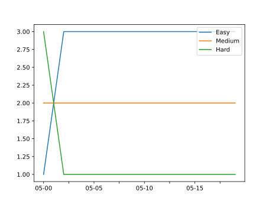

# 工具集合

## Go语言实现计算几何

https://github.com/WenRuige/geometry

## Go 语言学习资料与社区索引

https://github.com/Unknwon/go-study-index

## Go入门指南

https://github.com/unknwon/the-way-to-go_ZH_CN

## JSON去除转译

https://www.sojson.com/yasuo.html

## JSON在线格式化

https://jsoneditoronline.org/

## 时间戳

https://tool.chinaz.com/Tools/unixtime.aspx

## COS在线签名工具

http://costest.cn/

## Tencent文字识别软件

https://cloud.tencent.com/act/event/ocrdemo

## 画图工具excalidraw

## 在线PHP运行工具

## LeetCode题结

## 2048 小游戏

https://xbeibeix.com/api/game/2048/

