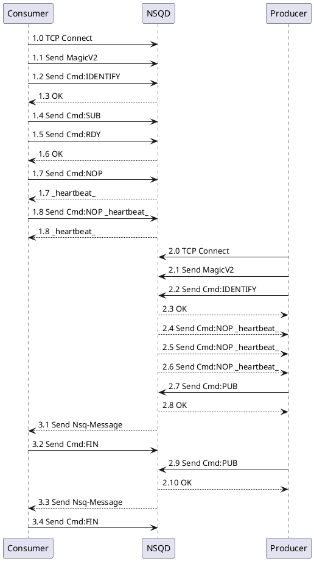

# Nsq学习笔记


> [!TIP|style:flat|label:引用头]
> 引用body1
> 
> In addition, this alert uses an own heading and hides specific icon.
> 
> 123132

https://www.jianshu.com/p/f3500554f41c


# 

- nsq_to_nsq
  - nsq客户端读取(消费)指定topic/channel数据,然后通过均衡策略由生产者再次发送


```go
package main

import (
	"flag"
	"fmt"
	"io"
	"net"
	"os"
	"time"

	"github.com/nsqio/go-nsq"
)

func main() {
	cosumser_gonsq()
}

func cosumser_gonsq() {
	// nsqd http address
	topic := ""
	channel := ""
	flag.StringVar(&topic, "t", "topic-1", "1")
	flag.StringVar(&channel, "c", "channel-1", "2")
	flag.Parse()

	NSQDsAddrs := []string{"127.0.0.1:4150"}
	go consumer(NSQDsAddrs, topic, channel)
	// go consumer(NSQDsAddrs, "topic-1", "channel-2")
	time.Sleep(30 * time.Minute)
}


/*
nsqlookupd

mkdir dataa
mkdir datab

nsqd --lookupd-tcp-address=127.0.0.1:4160 -broadcast-address=127.0.0.1 -tcp-address=127.0.0.1:4150 -http-address=0.0.0.0:4151 -data-path=./dataa
nsqd --lookupd-tcp-address=127.0.0.1:4160 -broadcast-address=127.0.0.1 -tcp-address=127.0.0.1:4152 -http-address=0.0.0.0:4153 -data-path=./datab

 nsqadmin --lookupd-http-address=localhost:4161

 http://127.0.0.1:4171
*/

func consumer(NSQDsAddrs []string, topic string, channel string) {
	cfg := nsq.NewConfig()
	consumer, err := nsq.NewConsumer(topic, channel, cfg)
	if err != nil {
		fmt.Printf("nsq.NewConsumer error(%s)\n", err.Error())
		return
	}

	consumer.AddHandler(nsq.HandlerFunc(
		func(message *nsq.Message) error {
			fmt.Printf("[%s:%s]messageBody:(%s)\n", topic, channel, string(message.Body))
			return nil
		}))
	if err := consumer.ConnectToNSQDs(NSQDsAddrs); err != nil {
		fmt.Printf("ConnectToNSQDs(%+v) error(%s)\n", NSQDsAddrs, err.Error())
	}
	<-consumer.StopChan
}

```

### NSQ 发送消息 消费消息流程



#### Consumer连接NSQD订阅消息流程 1.*

具体的命令格式 https://nsq.io/clients/tcp_protocol_spec.html

- 1.1 Send MagicV2  
  - 用来识别交互协议

- 1.2 IDENTIFY 
  - 发送Consumer的一些客户端信息

- 1.4 SUB 
  - 订阅 topic channel

- 1.5 RDY 
  - Consumer准备好接收消息

- 1.7 NOP 
  - 发送心跳 默认30S
  

#### Producer生产消息流程 2.*

#### Consumer消费消息流程 3.*

- 3.1 Send Nsq-Message  
  - 将内存/磁盘上的消息实体发给Consumer

- 3.2 FIN 
  - 表示一个消息已经被正确消费了，携带messageID

