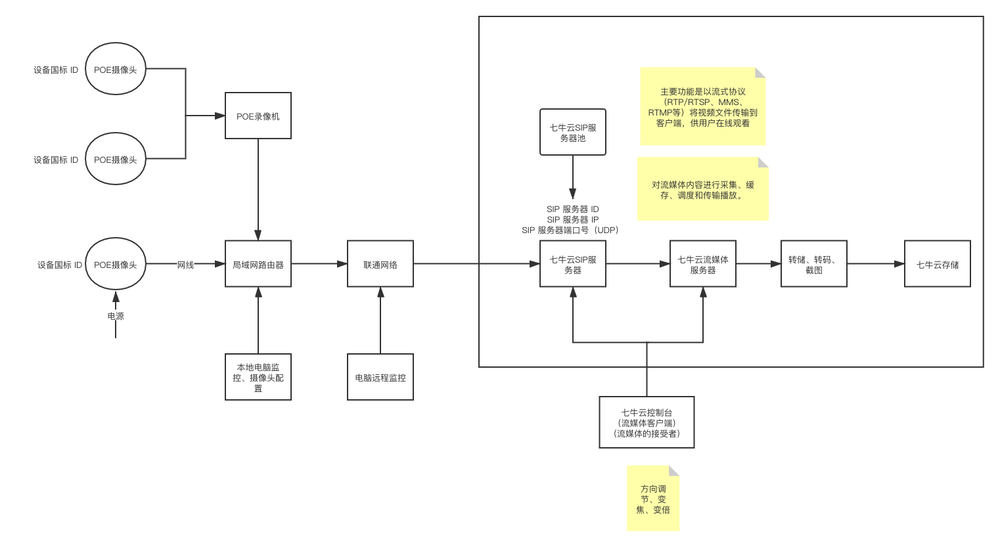
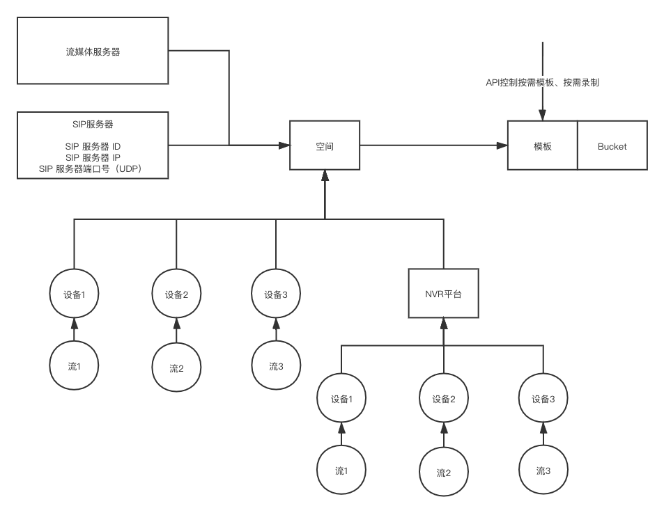
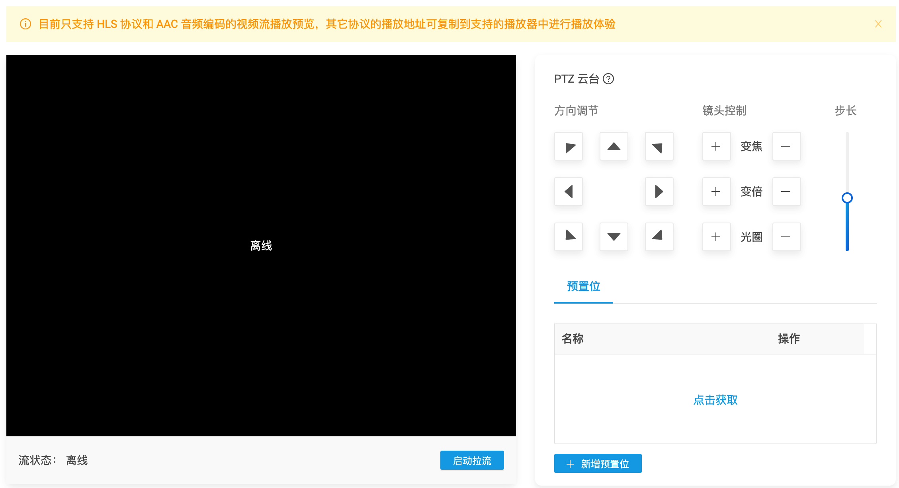
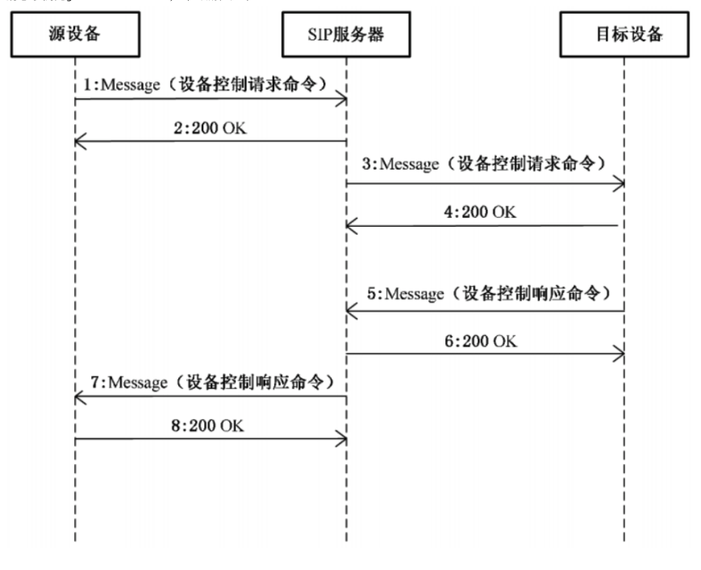
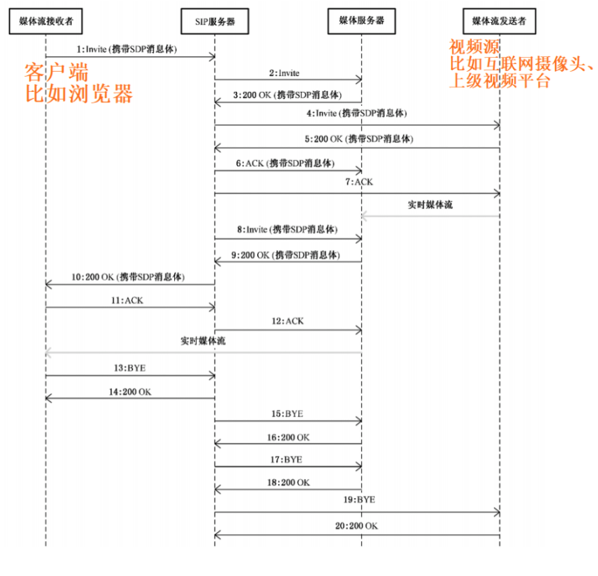
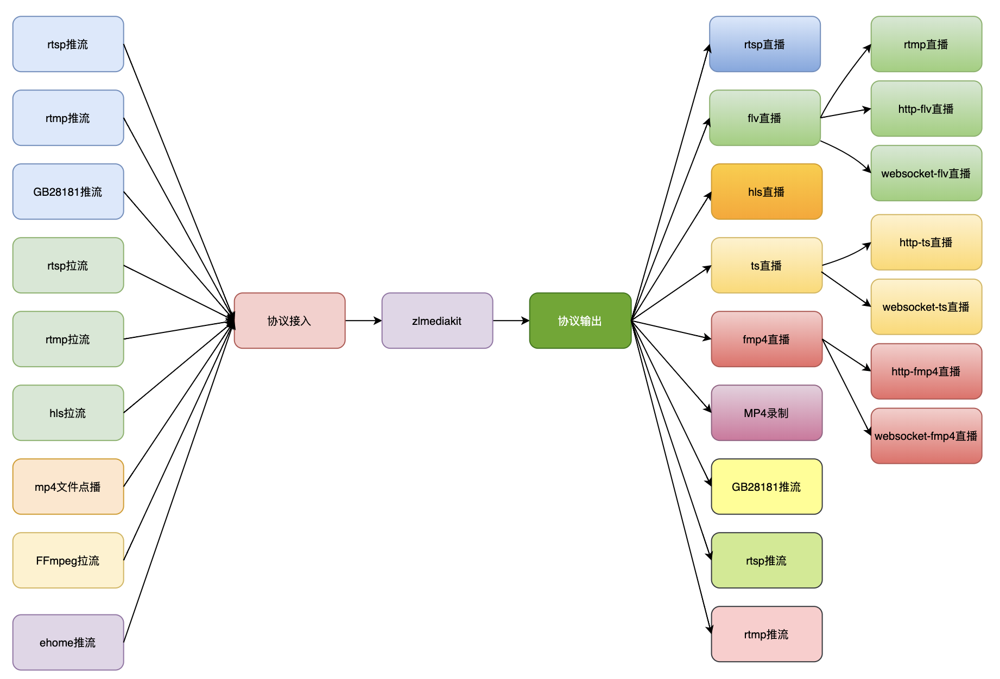
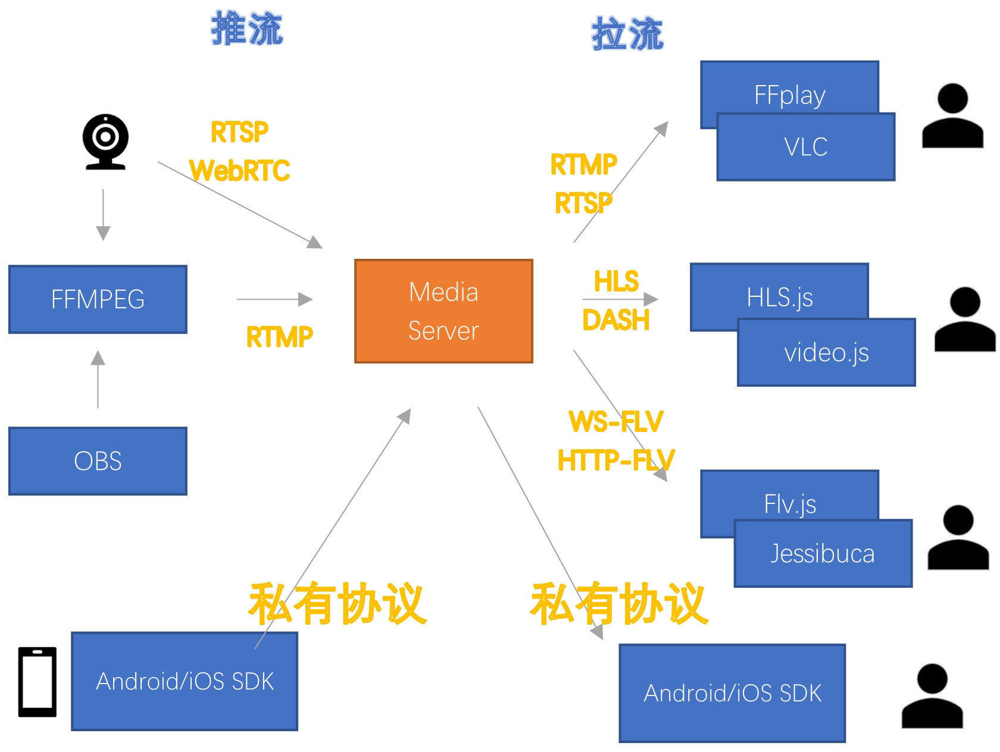

# 七牛云、阿里云-视频监控服务体验报告


## 


```
七牛云控制台
https://portal.qiniu.com/qvs/namespace

七牛云使用文档
https://developer.qiniu.com/qvs/6753/qvs-product-overview

七牛云工单
https://support.qiniu.com/tickets/245663


阿里云控制台
https://www.aliyun.com/product/vs

阿里云使用文档
https://help.aliyun.com/document_detail/108923.html?spm=a2c4g.11186623.6.542.315153b7EtGC3P

阿里云工单


```


## 体验搭建的一个网络结构



## 客户的操作历程


https://developer.qiniu.com/qvs/7448/gb-access-process

## 功能对比

|功能|七牛云|阿里云|腾讯云|
|---|---|---|---|
| **空间、模板、流 维度** |见下图用户、空间、bucket、模板、设备之间的关系|见下图用户、空间、bucket、模板、设备之间的关系|见下图用户、空间、bucket、模板、设备之间的关系|
| **模板类型**|录制、截图|录制、截图、转码|截图、转码、AI|
| **是否支持转储文件的生命周期** |永久保存/自定义|永久保存/自定义|X|
| **是否支持转储的存储类型** |支持 标准、低频可选|X|X|
| **录制类型** | 支持 实时录制、按需录制 | 支持 实时录制、按需录制 | X|
| **播放类型** | HLS FLV RTMP | HLS FLV RTMP | |
| **播放域名（下方示例）** | 不支持 | 支持CNAME | bucket域名 | 
| **分配SIP服务器** | 从SIP服务器池中分配 | 从SIP服务器池中分配 | X |
| **设备国标 ID** | 支持自动分配/用户配置 | 只能用户配置 | X |
| **GB接入的类型** | 摄像头/平台（IPC/NVR） | 摄像头/平台（IPC/NVR）  |X |
| **摄像头控制 PTZ云台和预设位 ,见下图PTZ控制**| 控制方向、镜头（变焦、变倍、光圈） |  控制方向、镜头（变焦、变倍、光圈） | X |


### 用户、空间、bucket、模板、设备之间的关系



### 播放域名（下方示例） 

#### 阿里云 支持自定义域名、CNAME
```
rtmp://demo.liudon.org/live/31011500991320000894?ali_rtmp_retain=0&auth_key=1611907388-0-0-9cb68a4988e286c9e913248a5e9b14d7

https://demo.liudon.org/live/31011500991320000894.m3u8?auth_key=1611907388-0-0-3f7fe9e85b0cceceb585766038844738

https://demo.liudon.org/live/31011500991320000894.flv?auth_key=1611907388-0-0-a6d89a007cbcf782423c510ba28cf54d


```

#### 七牛云


```
http://222.222.95.47:1370/2xenzw9985twp/31011500991320000894.m3u8?e=1611906086&token=52fdfc072182654d%3ALF4EgT4FvVudUJAyn4cDJyHndvw

http://222.222.95.47:1360/2xenzw9985twp/31011500991320000894.flv?e=1611906086&token=52fdfc072182654d%3AQS1kPwi7HIubn_lQpIXALhca0Lw

rtmp://222.222.95.47:2045/2xenzw9985twp/31011500991320000894?e=1611906086&token=52fdfc072182654d%3ANzv2fvm6zItv7D0fTbiqQP1TWPI
```


### PTZ控制示意图


-------------

## 七牛云 阿里云 差异化功能


### 按需拉流、按需类型模板

#### 七牛云 按需拉流、按需类型模板

1. 开启按需拉流后如何触发摄像头推流
- 控制台上实时预览页面中点击“启动拉流” 操作。
- 通过开始拉流api。
- 播放器进行播放请求。
以上3种都会触发摄像头推流，并且在无人观看持续60s左右，会自动终止摄像头推流。

2. 开启按需拉流后如何使用录制功能
开启按需拉流后，摄像头在推流的过程种，如果绑定了录制/截图模板，会自动进行录制/截图。如果不想触发自动录制/截图，请把录制/截图模板调整为“按需类型”的模板，这样需要通过开始录制api触发录制/截图。调用停止录制api结束录制，如未调用结束录制api会一直进行录制。
说明：
无论空间下"按需拉流"的开关是否开启，空间或者流都可以绑定普通的录制/截图模板，也可以绑定“按需”类型的录制/截图模板。普通类型的模板和按需类型的模板区别在于，如果绑定了普通的录制/截图模板,流在线时，就会自动开始录制/截图。 如果绑定了“按需”类型的模板，需要通过api触发录制的开始或者结束。


#### 阿里云 空间-按需拉流

1. 空间-按需拉流：开启后，当有播放时启动时才开始拉流，播放结束后60秒自动停止拉流，对本空间内所有设备生效。特别提示：如果启动按需拉流，请不要同时使用普通录制、时移录制、覆盖截图、实时截图，以上方式的录制、截图都是周期性行为，会导致一直有拉流产生。按需的场景如果需要使用截图和录制功能，请配置按需录制和按需截图。


----------------------------

# 体验痛点

- 没有推荐接入设备：推荐某种型号的测试接入设备供用户使用、进行体验。

- 网络问题让人抓狂：开发一个检查工具排查网络问题，排查当前设备不在线、注册失败、拉取流失败、不能实时获取监控的问题。

- 用户接入难度问题：考虑录制一个开发者教程，从买摄像头开始，手把手教学、故障排查。

- 网络摄像头推荐配置：心跳时间、过期时间、端口。参数如何配置会有哪些不同的效果。

-----------------------------


# 开发者可能关注的东西 


## SID其实不同平台是可以重复的。

## 简单了解SIP协议


### info

```
有趣的blog
http://www.demo1024.com/categories/%E5%86%99%E4%BB%A3%E7%A0%81/%E8%A7%86%E9%A2%91%E6%8A%80%E6%9C%AF/page/2/


国标协议
http://www.nic.bjchyedu.cn/zwgk/zcfg/201705/P020170503381310092654.pdf


SIP
https://support.huawei.com/enterprise/zh/doc/EDOC1000082155?section=j006


```


### 源设备向目标设备发送录像控制控制信息示例（控制摄像头变焦、方向。。。）




### 客户端如何通过SIP服务器进行实时视音点播示例 （拉流、录制）




### 流媒体服务器的功能 协议的接入、协议的输出







## [一个基于C++11的高性能运营级流媒体服务框架 ZLMediaKit](https://github.com/xia-chu/ZLMediaKit)


## [SIP服务开源软件](https://github.com/swwheihei/wvp-GB28181) 是一个基于GB28181-2016标准实现的网络视频平台，负责实现核心信令与设备管理后台部分，支持NAT穿透，支持海康、大华、宇视等品牌的IPC、NVR、DVR接入、主要应用在IPC等设备没有固定IP地址，但需要在互联网中观看的场景。


----------------------

# 扩展连接


http://www.demo1024.com/blog/gb28181/

https://www.cnblogs.com/easygbs/p/12936149.html

https://cloud.tencent.com/developer/article/1630106


EasyNVR

http://www.easynvr.com/

https://github.com/EasyNVR/EasyNVR


基于国标GB/T28181标准从海康摄像头获取PS流

https://blog.yasking.org/a/get-ps-stream-from-hik.html


srs

https://zhuanlan.zhihu.com/p/141113179


NVR

https://zhuanlan.zhihu.com/p/51152551

-----------------------


# 杂

若希望做低延迟直播（3-5秒），可用HTTP-FLV，播放器用flv.js，H5/MSE播放HTTP-FLV
若对延迟不敏感（5-10秒），跨平台比较好，可用HLS，播放器用hls.js，H5/MSE播放HLS
若希望超低延迟（1秒内），只需要支持主流的浏览器，可用WebRTC，播放器用RTC播放器


----------------------


# 专业术语

- IPC	IPC是网络摄像机（Internet Protocol Camera）的缩写。
- NVR	NVR是网络硬盘录像机（Network Video Recorder）的缩写。
- RTMP	RTMP是Real Time Messaging Protocol（实时消息传输协议）的首字母缩写。该协议基于TCP，是一个协议族，包括RTMP基本协议及RTMPT/RTMPS/RTMPE等多种变种。RTMP是一种设计用来进行实时数据通信的网络协议，主要用来在Flash/AIR平台和支持RTMP协议的流媒体/交互服务器之间进行音视频和数据通信。
- GB/T28181	GB/T28181《安全防范视频监控联网系统信息传输、交换、控制技术要求》是由公安部科技信息化局提出，由全国安全防范报警系统标准化技术委员会、公安部一所等多家单位共同起草的一部国家标准。标准规定了城市监控报警联网系统中信息传输、交换、控制的互联结构、通信协议结构，传输、交换、控制的基本要求和安全性要求，以及控制、传输流程和协议接口等技术要求。该标准适用于安全防范监控报警联网系统的方案设计、系统检测、验收以及与之相关的设备研发、生产，其他信息系统可参考采用。联网系统应对前端设备、监控中心设备、用户终端ID进行统一编码,该编码具有全局唯一性。
- HLS	HLS (HTTP Live Streaming)是Apple的动态码率自适应技术。主要用于PC和Apple终端的音视频服务。包括一个m3u8的索引文件，TS媒体分片文件和key加密串文件。
- TS	TS的全称则是Transport Stream，TS流文件，是一种DVD的文件格式，MPEG2-TS格式的特点就是要求从视频流的任一片段开始都是可以独立解码的。
- FLV	FLV 是FLASH VIDEO的简称，FLV流媒体格式是随着Flash MX的推出发展而来的视频格式。由于它形成的文件极小、加载速度极快，使得网络观看视频文件成为可能，它的出现有效地解决了视频文件导入Flash后，使导出的SWF文件体积庞大，不能在网络上很好的使用等问题。