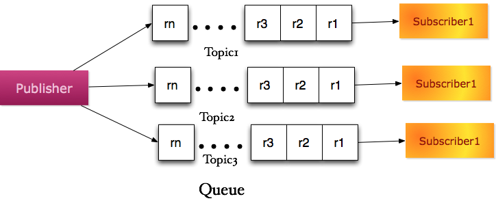
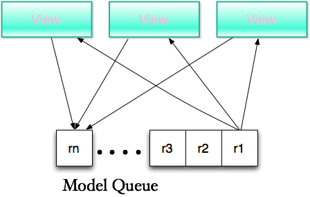
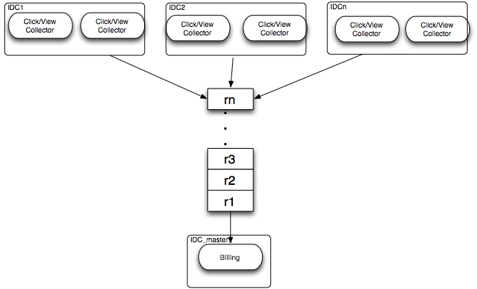
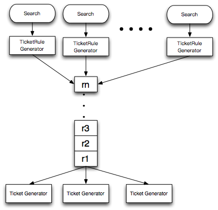

# 分布式队列编程：模型、实战

作为一种基础的抽象数据结构，队列被广泛应用在各类编程中。大数据时代对跨进程、跨机器的通讯提出了更高的要求，和以往相比，分布式队列编程的运用几乎已无处不在。但是，这种常见的基础性的事物往往容易被忽视，使用者往往会忽视两点： 
* 使用分布式队列的时候，没有意识到它是队列。 
* 有具体需求的时候，忘记了分布式队列的存在。

文章首先从最基础的需求出发，详细剖析分布式队列编程模型的需求来源、定义、结构以及其变化多样性。通过这一部分的讲解，作者期望能在两方面帮助读者：
* 一方面，提供一个系统性的思考方法，使读者能够将具体需求关联到分布式队列编程模型，具备进行分布式队列架构的能力；
* 另一方面，通过全方位的讲解，让读者能够快速识别工作中碰到的各种分布式队列编程模型。

文章的第二部分实战篇。根据作者实际工作经验，给出了队列式编程在分布式环境下的一些具体应用。这些例子的基础模型并非首次出现在互联网的文档中，但是所有的例子都是按照挑战、构思、架构三个步骤进行讲解的。这种讲解方式能给读者一个“从需求出发去构架分布式队列编程”的旅程。

模型篇从基础的需求出发，去思考何时以及如何使用分布式队列编程模型。建模环节非常重要，因为大部分中高级工程师面临的都是具体的需求，接到需求后的第一个步骤就是建模。通过本篇的讲解，希望读者能够建立起从需求到分布式队列编程模型之间的桥梁。

------------------------

## 何时选择分布式队列

通讯是人们最基本的需求，同样也是计算机最基本的需求。对于工程师而言，在编程和技术选型的时候，更容易进入大脑的概念是RPC、RESTful、Ajax、Kafka。在这些具体的概念后面，最本质的东西是“通讯”。所以，大部分建模和架构都需要从“通讯”这个基本概念开始。当确定系统之间有通讯需求的时候，工程师们需要做很多的决策和平衡，这直接影响工程师们是否会选择分布式队列编程模型作为架构。从这个角度出发，影响建模的因素有四个：When、Who、Where、How。

### When：同步VS异步
通讯的一个基本问题是：发出去的消息什么时候需要被接收到？这个问题引出了两个基础概念：“同步通讯”和“异步通讯”。根据理论抽象模型，同步通讯和异步通讯最本质的差别来自于时钟机制的有无。同步通讯的双方需要一个校准的时钟，异步通讯的双方不需要时钟。现实的情况是，没有完全校准的时钟，所以没有绝对的同步通讯。同样，绝对异步通讯意味着无法控制一个发出去的消息被接收到的时间点，无期限的等待一个消息显然毫无实际意义。所以，实际编程中所有的通讯既不是“同步通讯”也不是“异步通讯”；或者说，既是“同步通讯”也是“异步通讯”。特别是对于应用层的通讯，其底层架构可能既包含“同步机制”也包含“异步机制”。判断“同步”和“异步”消息的标准问题太深，而不适合继续展开。作者这里给一些启发式的建议： 

* 发出去的消息是否需要确认，如果不需要确认，更像是异步通讯，这种通讯有时候也称为单向通讯（One-Way Communication）。 
* 如果需要确认，可以根据需要确认的时间长短进行判断。时间长的更像是异步通讯，时间短的更像是同步通讯。当然时间长短的概念是纯粹的主观概念，不是客观标准。 
* 发出去的消息是否阻塞下一个指令的执行，如果阻塞，更像是同步，否则，更像是异步。

无论如何，工程师们不能生活在混沌之中，不做决定往往是最坏的决定。当分析一个通讯需求或者进行通讯构架的时候，工程师们被迫作出“同步”还是“异步”的决定。当决策的结论是“异步通讯”的时候，分布式队列编程模型就是一个备选项。

### Who：发送者接收者解耦
在进行通讯需求分析的时候，需要回答的另外一个基本问题是：消息的发送方是否关心谁来接收消息，或者反过来，消息接收方是否关心谁来发送消息。如果工程师的结论是：消息的发送方和接收方不关心对方是谁、以及在哪里，分布式队列编程模型就是一个备选项。因为在这种场景下，分布式队列架构所带来的解耦能给系统架构带来这些好处： 
* 无论是发送方还是接收方，只需要跟消息中间件通讯，接口统一。统一意味着降低开发成本。 
* 在不影响性能的前提下，同一套消息中间件部署，可以被不同业务共享。共享意味着降低运维成本。 
* 发送方或者接收方单方面的部署拓扑的变化不影响对应的另一方。解藕意味着灵活和可扩展。

### Where：消息暂存机制
在进行通讯发送方设计的时候，令工程师们苦恼的问题是：如果消息无法被迅速处理掉而产生堆积怎么办、能否被直接抛弃？如果根据需求分析，确认存在消息积存，并且消息不应该被抛弃，就应该考虑分布式队列编程模型构架，因为队列可以暂存消息。

### How：如何传递
对通讯需求进行架构，一系列的基础挑战会迎面而来，这包括： 
* 可用性，如何保障通讯的高可用。 
* 可靠性，如何保证消息被可靠地传递。 
* 持久化，如何保证消息不会丢失。 
* 吞吐量和响应时间。 
* 跨平台兼容性。 除非工程师对造轮子有足够的兴趣，并且有充足的时间，采用一个满足各项指标的分布式队列编程模型就是一个简单的选择。

-------------------

## 分布式队列编程定义

很难给出分布式队列编程模型的精确定义，由于本文偏重于应用，作者并不打算完全参照某个标准的模型。总体而言：分布式队列编程模型包含三类角色：发送者（Sender）、分布式队列（Queue）、接收者（Receiver）。发送者和接收者分别指的是生产消息和接收消息的应用程序或服务。 需要重点明确的概念是分布式队列，它是提供以下功能的应用程序或服务：
* 接收“发送者”产生的消息实体；
* 传输、暂存该实体；
* 为“接收者”提供读取该消息实体的功能。特定的场景下，它当然可以是Kafka、RabbitMQ等消息中间件。但它的展现形式并不限于此，例如： 
* 队列可以是一张数据库的表，发送者将消息写入表，接收者从数据表里读消息。 
* 如果一个程序把数据写入Redis等内存Cache里面，另一个程序从Cache里面读取，缓存在这里就是一种分布式队列。 
* 流式编程里面的的数据流传输也是一种队列。 
* 典型的MVC（Model–view–controller）设计模式里面，如果Model的变化需要导致View的变化，也可以通过队列进行传输。这里的分布式队列可以是数据库，也可以是某台服务器上的一块内存。

### 抽象模型
最基础的分布式队列编程抽象模型是点对点模型，其他抽象构架模型居于改基本模型上各角色的数量和交互变化所导致的不同拓扑图。具体而言，不同数量的发送者、分布式队列以及接收者组合形成了不同的分布式队列编程模型。记住并理解典型的抽象模型结构对需求分析和建模而言至关重要，同时也会有助于学习和深入理解开源框架以及别人的代码。

#### 点对点模型（Point-to-point）
基础模型中，只有一个发送者、一个接收者和一个分布式队列。如下图所示：

#### 生产者消费者模型（Producer–consumer）
如果发送者和接收者都可以有多个部署实例，甚至不同的类型；但是共用同一个队列，这就变成了标准的生产者消费者模型。在该模型，三个角色一般称之为生产者（Producer）、分布式队列（Queue）、消费者（Consumer）。

#### 发布订阅模型（PubSub）
如果只有一类发送者，发送者将产生的消息实体按照不同的主题（Topic）分发到不同的逻辑队列。每种主题队列对应于一类接收者。这就变成了典型的发布订阅模型。在该模型，三个角色一般称之为发布者（Publisher），分布式队列（Queue），订阅者（Subscriber）。

#### MVC模型
如果发送者和接收者存在于同一个实体中，但是共享一个分布式队列。这就很像经典的MVC模型。

### 编程模型

为了让读者更好地理解分布式队列编程模式概念，这里将其与一些容易混淆的概念做一些对比。

#### 分布式队列模型编程和异步编程

分布式队列编程模型的通讯机制一般是采用异步机制，但是它并不等同于异步编程。 

首先，并非所有的异步编程都需要引入队列的概念，例如：大部分的操作系统异步I/O操作都是通过硬件中断（ Hardware Interrupts）来实现的。 其次，异步编程并不一定需要跨进程，所以其应用场景并不一定是分布式环境。 最后，分布式队列编程模型强调发送者、接收者和分布式队列这三个角色共同组成的架构。这三种角色与异步编程没有太多关联。

#### 分布式队列模式编程和流式编程

随着Spark Streaming，Apache Storm等流式框架的广泛应用，流式编程成了当前非常流行的编程模式。但是本文所阐述的分布式队列编程模型和流式编程并非同一概念。 

首先，本文的队列编程模式不依赖于任何框架，而流式编程是在具体的流式框架内的编程。 其次，分布式队列编程模型是一个需求解决方案，关注如何根据实际需求进行分布式队列编程建模。流式框架里的数据流一般都通过队列传递，不过，流式编程的关注点比较聚焦，它关注如何从流式框架里获取消息流，进行map、reduce、 join等转型（Transformation）操作、生成新的数据流，最终进行汇总、统计。

---------------------------------------

> 真实案例。实战篇的关注点是训练建模思路，所以这些例子都按照挑战、构思、架构三个步骤进行讲解。受限于保密性要求，有些细节并未给出，但这些细节并不影响讲解的完整性。另一方面，特别具体的需求容易让人费解，为了使讲解更加顺畅，作者也会采用一些更通俗易懂的例子。通过本篇的讲解，希望和读者一起去实践“如何从需求出发去构架分布式队列编程模型”。

需要声明的是，这里的解决方案并不是所处场景的最优方案。但是，任何一个稍微复杂的问题，都没有最优解决方案，更谈不上唯一的解决方案。实际上，工程师每天所追寻的只是在满足一定约束条件下的可行方案。当然不同的约束会导致不同的方案，约束的松弛度决定了工程师的可选方案的宽广度。

## 信息采集处理
信息采集处理应用广泛，例如：广告计费、用户行为收集等。作者碰到的具体项目是为广告系统设计一套高可用的采集计费系统。 典型的广告CPC、CPM计费原理是：收集用户在客户端或者网页上的点击和浏览行为，按照点击和浏览进行计费。计费业务有如下典型特征： 
* 采集者和处理者解耦，采集发生在客户端，而计费发生在服务端。 
* 计费与钱息息相关。 
* 重复计费意味着灾难。 
* 计费是动态实时行为，需要接受预算约束，如果消耗超过预算，则广告投放需要停止。 
* 用户的浏览和点击量非常大。

### 挑战
计费业务的典型特征给我们带来了如下挑战： * 高吞吐量－－广告的浏览和点击量非常巨大，我们需要设计一个高吞吐量的采集架构。 * 高可用性－－计费信息的丢失意味着直接的金钱损失。任何处理服务器的崩溃不应该导致系统不可用。 * 高一致性要求－－计费是一个实时动态处理过程，但要受到预算的约束。收集到的浏览和点击行为如果不能快速处理，可能会导致预算花超，或者点击率预估不准确。所以采集到的信息应该在最短的时间内传输到计费中心进行计费。 * 完整性约束－－这包括反作弊规则，单个用户行为不能重复计费等。这要求计费是一个集中行为而非分布式行为。 * 持久化要求－－计费信息需要持久化，避免因为机器崩溃而导致收集到的数据产生丢失。

### 构思
采集的高可用性意味着我们需要多台服务器同时采集，为了避免单IDC故障，采集服务器需要部署在多IDC里面。 实现一个高可用、高吞吐量、高一致性的信息传递系统显然是一个挑战，为了控制项目开发成本，采用开源的消息中间件进行消息传输就成了必然选择。 完整性约束要求集中进行计费，所以计费系统发生在核心IDC。 计费服务并不关心采集点在哪里，采集服务也并不关心谁进行计费。 根据以上构思，我们认为采集计费符合典型的“生产者消费者模型”。

### 架构
采集计费系统架构图如下： 
* 用户点击浏览收集服务（Click/View Collector）作为生产者部署在多个机房里，以提高收集服务可用性。 
* 每个机房里采集到的数据通过消息队列中间件发送到核心机房IDC_Master。 
* Billing服务作为消费者部署在核心机房集中计费。

采用此架构，我们可以在如下方面做进一步优化： 
* 提高可扩展性，如果一个Billing部署实例在性能上无法满足要求，可以对采集的数据进行主题分区（Topic Partition）计费，即采用发布订阅模式以提高可扩展性（Scalability）。 
* 全局排重和反作弊。采用集中计费架构解决了点击浏览排重的问题，另一方面，这也给反作弊提供了全局信息。 
* 提高计费系统的可用性。采用下文单例服务优化策略，在保障计费系统集中性的同时，提高计费系统可用性。

## 后台任务处理
典型的后台任务处理应用包括工单处理、火车票预订系统、机票选座等。我们所面对的问题是为运营人员创建工单。一次可以为多个运营人员创建多个工单。这个应用场景和火车票购买非常类似。工单相对来说更加抽象，所以，下文会结合火车票购买和运营人员工单分配这两种场景同时讲解。典型的工单创建要经历两个阶段：数据筛选阶段、工单创建阶段。例如，在火车票预订场景，数据筛选阶段用户选择特定时间、特定类型的火车，而在工单创建阶段，用户下单购买火车票。

### 挑战
工单创建往往会面临如下挑战： 
* 数据一致性问题。以火车票预订为例，用户筛选火车票和最终购买之间往往有一定的时延，意味着两个操作之间数据是不一致的。在筛选阶段，工程师们需决定是否进行车票锁定，如果不锁定，则无法保证出票成功。反之，如果在筛选地时候锁定车票，则会大大降低系统效率和出票吞吐量。 
* 约束问题。工单创建需要满足很多约束，主要包含两种类型：动态约束，与操作者的操作行为有关，例如购买几张火车票的决定往往发生在筛选最后阶段。隐性约束，这种约束很难通过界面进行展示，例如一个用户购买了5张火车票，这些票应该是在同一个车厢的临近位置。 
* 优化问题。工单创建往往是约束下的优化，这是典型的统筹优化问题，而统筹优化往往需要比较长的时间。 
* 响应时间问题。对于多任务工单，一个请求意味着多个任务产生。这些任务的创建往往需要遵循事务性原则，即All or Nothing。在数据层面，这意味着工单之间需要满足串行化需求（Serializability）。大数据量的串行化往往意味着锁冲突延迟甚至失败。无论是延迟机制所导致的长时延，还是高创建失败率，都会大大伤害用户体验。

### 构思
如果将用户筛选的最终规则做为消息存储下来，并发送给工单创建系统。此时，工单创建系统将具备创建工单所需的全局信息，具备在满足各种约束的条件下进行统筹优化的能力。如果工单创建阶段采用单实例部署，就可以避免数据锁定问题，同时也意味着没有锁冲突，所以也不会有死锁或任务延迟问题。 居于以上思路，在多工单处理系统的模型中，筛选阶段的规则创建系统将充当生产者角色，工单创建系统将充当消费者角色，筛选规则将作为消息在两者之间进行传递。这就是典型的分布式队列编程架构。根据工单创建量的不同，可以采用数据库或开源的分布式消息中间件作为分布式队列。

### 架构
该架构流程如下图： 
* 用户首选进行规则创建，这个过程主要是一些搜索筛选操作； 
* 用户点击工单创建，TicketRule Generator将把所有的筛选性组装成规则消息并发送到队列里面去； 
* Ticket Generator作为一个消费者，实时从队列中读取工单创建请求，开始真正创建工单。

采用该架构，我们在数据锁定、运筹优化、原子性问题都能得到比较好成果： 
* 数据锁定推迟到工单创建阶段，可以减少数据锁定范围，最大程度的降低工单创建对其他在线操作的影响范围。 
* 如果需要进行统筹优化，可以将Ticket Generator以单例模式进行部署（参见单例服务优化）。这样，Ticket Generator可以读取一段时间内的工单请求，进行全局优化。例如，在我们的项目中，在某种条件下，运营人员需要满足分级公平原则，即相同级别的运营人员的工单数量应该接近，不同级别的运营人员工单数量应该有所区分。如果不集中进行统筹优化，实现这种优化规则将会很困难。 
* 保障了约束完整性。例如，在我们的场景里面，每个运营人员每天能够处理的工单是有数量限制的，如果采用并行处理的方式，这种完整性约束将会很难实施。