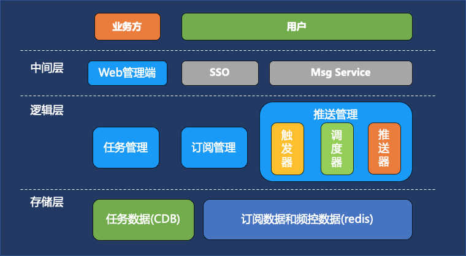
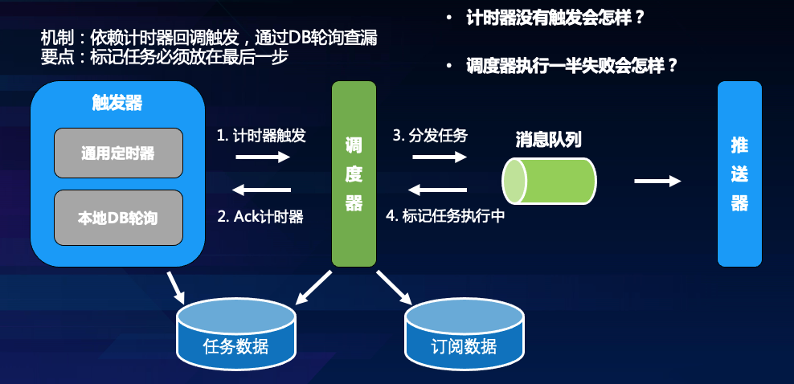
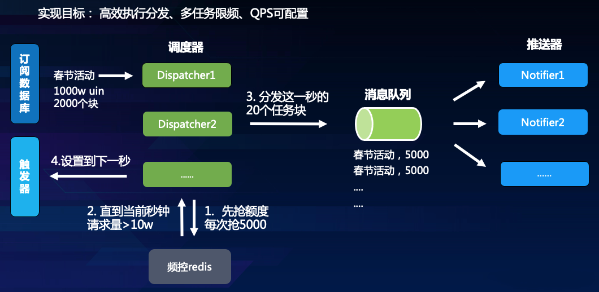
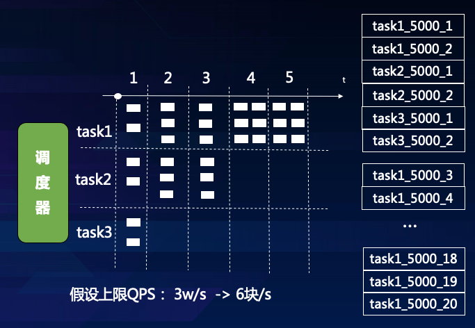
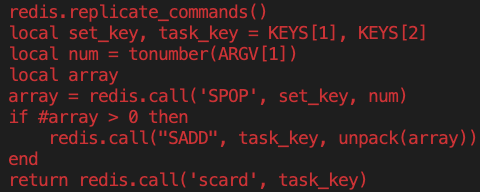
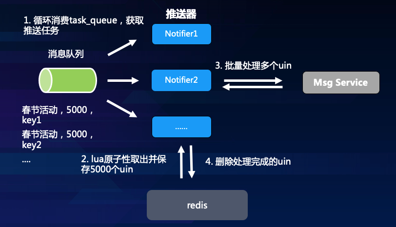

<!-- START doctoc generated TOC please keep comment here to allow auto update -->
<!-- DON'T EDIT THIS SECTION, INSTEAD RE-RUN doctoc TO UPDATE -->
**Table of Contents**  *generated with [DocToc](https://github.com/thlorenz/doctoc)*

- [QQ提醒一个大流量订阅推送系统的实现思路](#qq%E6%8F%90%E9%86%92%E4%B8%80%E4%B8%AA%E5%A4%A7%E6%B5%81%E9%87%8F%E8%AE%A2%E9%98%85%E6%8E%A8%E9%80%81%E7%B3%BB%E7%BB%9F%E7%9A%84%E5%AE%9E%E7%8E%B0%E6%80%9D%E8%B7%AF)
  - [一、系统需求分析](#%E4%B8%80%E7%B3%BB%E7%BB%9F%E9%9C%80%E6%B1%82%E5%88%86%E6%9E%90)
    - [业务场景:](#%E4%B8%9A%E5%8A%A1%E5%9C%BA%E6%99%AF)
    - [业务流程:](#%E4%B8%9A%E5%8A%A1%E6%B5%81%E7%A8%8B)
  - [二、技术要点](#%E4%BA%8C%E6%8A%80%E6%9C%AF%E8%A6%81%E7%82%B9)
  - [三、整体架构](#%E4%B8%89%E6%95%B4%E4%BD%93%E6%9E%B6%E6%9E%84)
  - [四、方案详述](#%E5%9B%9B%E6%96%B9%E6%A1%88%E8%AF%A6%E8%BF%B0)
    - [1、推拉结合](#1%E6%8E%A8%E6%8B%89%E7%BB%93%E5%90%88)
    - [2、异构存储](#2%E5%BC%82%E6%9E%84%E5%AD%98%E5%82%A8)
    - [3、多重触发](#3%E5%A4%9A%E9%87%8D%E8%A7%A6%E5%8F%91)
    - [4、可控调度](#4%E5%8F%AF%E6%8E%A7%E8%B0%83%E5%BA%A6)
      - [*幂等性如何保证*](#%E5%B9%82%E7%AD%89%E6%80%A7%E5%A6%82%E4%BD%95%E4%BF%9D%E8%AF%81)
    - [5、打散执行](#5%E6%89%93%E6%95%A3%E6%89%A7%E8%A1%8C)
      - [*如何分块*](#%E5%A6%82%E4%BD%95%E5%88%86%E5%9D%97)
    - [6、引入消息队列](#6%E5%BC%95%E5%85%A5%E6%B6%88%E6%81%AF%E9%98%9F%E5%88%97)
    - [7、用户级别的可靠推送](#7%E7%94%A8%E6%88%B7%E7%BA%A7%E5%88%AB%E7%9A%84%E5%8F%AF%E9%9D%A0%E6%8E%A8%E9%80%81)

<!-- END doctoc generated TOC please keep comment here to allow auto update -->

# QQ提醒一个大流量订阅推送系统的实现思路


> 本文从实际业务场景出发，以QQ提醒为例，阐述一个可靠的订阅推送系统的技术要点和实现思路。总结起来，主要包括以下几点：推拉结合、异构存储、多重触发、可控调度、打散执行、可靠推送。


## 一、系统需求分析

### 业务场景:

QQ提醒（http://tixing.oa.com/ ）的主要业务场景比如：

- 使命与召唤手游在1月18日早上10点发布，提醒预约用户下载并领取礼包
- 春节刷一刷红包在小年当天晚上8点05分开始，提醒订阅用户参与
  
### 业务流程:

1. 业务在管理端建立推送任务
2. 用户在终端订阅推送任务
3. 预设时间到时通过消息服务给所有订阅的用户推送消息


## 二、技术要点

不难看出，这是一个通过预设时间触发的订阅推送系统，我们对它的技术要点主要考虑几方面：

1. 推送可靠性
    - 任何业务方在系统上配置的任务都应该得到触发
    - 任何订阅了提醒任务的用户都应该收到推送消息
2. 推送可控性
    - 消息服务的容量是有上限的，系统的总体消息推送速率不能超过该上限，而业务投放的任务却有一定随机性，可能某一时刻没有任务，可能某一时刻多个任务同时触发。所以系统必须在总体上做速率把控，避免推送过快导致下游处理失败，影响业务体验，甚至如果造成下游消息服务雪崩，后果就不堪设想。

3. 推送高效性
    - 当然在满足可靠和可控两点要求之后，我们也应该考虑提高系统的推送速度，以满足业务的更高的时效性要求。之所以把高效推送放在最后是因为在我们的场景下做高并发是简单的，做高可靠和可控反而较复杂。

话不多说，下面就看下这些技术要点应该如何实现。


## 三、整体架构



## 四、方案详述

### 1、推拉结合
首先问一个问题，提醒推送系统就一定要通过推送来下发提醒吗？答案是否定的，既然推送的内容是固定的，那我们当然可以提前将任务数据下发到客户端，让客户端自行计时触发提醒。类似于配置下发系统一样。但如果采用类似于配置预下发的方式，那就涉及到一个问题，提前下发，提前多久下发呢，提前太久，如果下发后任务需要修改怎么办，对于我们的业务，这是很常见的，比如一个游戏原定时间发布不了（俗称跳票），需要修改到一个月后或者更久触发提醒。那这个修改如果没有被客户端拉取到，那么客户端就会在原定时间触发提醒（尤其iOS客户端本地采用系统级别localnotification触发提醒，无法阻止），最后必然导致用户投诉，业务口碑受损。
所以经过权衡，我们采取推拉结合的方式，即允许部分用户提前拉取到任务，未拉取的走推送。这个预下发的提前量是提醒当天0点开始，因此我们也强制要求业务不能在提醒当天再修改任务信息，包括提醒时间和提醒内容，因为当天0点之后用户就开始拉取，必须保证任务时间和内容不变。


### 2、异构存储
系统主要会有两块数据：

业务创建的任务数据，包含任务的提醒时间和提醒内容
用户订阅生成的订阅数据，主要是订阅用户uin列表数据，这个列表元素级别可达到千万以上，并且必须要能够快速读取
这里存储选型主要从访问速度上考虑，任务数据可靠性要求高，不需要快速存取，使用mysql即可；订阅列表数据需要频繁读写，且推送触发时对于存取效率要求较高，考虑使用内存型数据库。

最终我们采用的是redis的set类型来存储订阅列表，有以下好处：

- redis单线程模型，有效避免读写冲突
- set底层基于intset和hash表实现，存储整型uin在空间和时间上均高效
- 原生支持去重
- 原生支持高效的批量取接口（spop），适合于推送时使用


### 3、多重触发
再问一个问题，计时服务一般是怎么做的？分布式计时任务有很多成熟的实现方案，一般是采用延迟队列来实现，比如redis sorted set或者利用rabbit mq死信队列来实现，这方面感兴趣可以阅读这位同学的文章《你真的知道怎么实现一个延迟队列吗？》，这里我们使用的手Q通用计时器组件，即是基于redis sorted set实现。
为了保证任务能够被可靠触发，我们又增加了本地数据库轮询，假如外部组件通用计时器没有准时回调我们，本地轮询会在延迟3秒后将还未触发的任务进行触发，这里主要是为了防止外部组件可能的故障导致业务触发失败，增加一个本地的扫描查漏补缺。注意引入这样的机制就可能会带来任务多次触发的可能（本地扫描触发了，同一时间计时器也恢复），这就需要我们保证任务触发的幂等性（即多次触发最终效果一致，不会重复推送）。

触发流程:




### 4、可控调度
如前所述，当多个千万级别的推送任务在同一时间触发时，推送量是很可观的，系统需要具备总体的任务间调度控制能力。因此需要引入调度器，由调度器来控制每一秒钟的推送量，调度器必须是分布式，以避免单点服务，因此这是一个分布式限频的问题，感兴趣可以阅读《单机和分布式场景下，有哪些流控方案？》，这里我们简单实用redis INCR命令计数，记录当前秒钟的请求量，所有调度器都尝试将当前任务需要下发的量累加到这个值上，如果累加的结果没有超过配置值，则继续累加，最后超过配置值时，每个调度器按照自己抢到的下发量进行下发，简单点说就是下发任务前先抢额度，抢到额度在下发。当额度用完或者没有抢到额度，则等待下一秒。伪代码如下：

```
FUNCTION LIMIT_API_CALL(rate_key):
current = GET(rate_key)
IF current != NULL AND current > 10 THEN
    Wait for next second
ELSE
    value = INCR(rate_key)
    IF value == 1 THEN
	EXPIRE(rate_key,1)
    END
    PERFORM_API_CALL()
END
```

调度流程:




#### *幂等性如何保证*

讲完了调度的实现，再来论证下幂等性是否成立：
假设第一种情况，调度器执行了一半挂了，后面又再次对同一个任务进行调度，由于调度器每次对一个任务进行调度时，都会先查看任务当前剩余推送量（即任务还剩多少块），根据任务的剩余块数来继续调度，所以，当任务再次触发时，调度器可以接着前面的任务继续完成。
假设第二种情况，一个任务被同时触发两次，由两个调度器同时进行调度，那么两个调度器会互相抢额度，抢到后用在同一个任务，从执行效果来看，和一个调度器没有差别。
因此，任务可以被重复触发。


### 5、打散执行

任务分块执行的必要性在于，将任务打散分成小任务了，才能实现细粒度的调度，否则，几个1000w级别的任务，你如何调度？假如将所有任务都拆分成5000量级的小任务块，那么速率控制就转化成分发小任务块的块数控制，假设配置的总体速率是3w uin/s，那么调度器每一秒最多可以下发6个任务块。这6个任务块可以是多个任务的。如下图所示：



同时，任务分块执行还有其他好处，将任务分成多块均衡分配给后端的worker去执行，可以提高推送的并发量，同时减少后端worker异常的影响粒度。

#### *如何分块*


那么，如何分块呢？具体实现时，调度器负责按配置值下发指令，指令类似于：“到某个任务的列表上取一个任务块，任务块大小5000个uin，并执行下发“。后端的推送器worker收到指令后，便到指定的任务订阅列表上（redis set实现），通过spop获取到5000个uin，执行推送。

### 6、引入消息队列
消息队列的意义在于：

- 将任务调度和任务执行解耦（调度服务并不需要关心任务执行结果）
- 异步化，保证调度服务的高效执行，调度服务的执行是以ms为单位
- 借助消息队列实现任务的可靠消费


### 7、用户级别的可靠推送
用户级别的可靠性即是保证所有订阅用户都被至少推送一次（At least once），如何做到这一点呢？前提就必须是当把用户uin从订阅列表中取出进行推送后，在推送结果返回之前，必须保证用户uin被妥善保存，以防止推送失败后没有机会再推送。由于redis没有提供从一个set中批量move数据到另一个set中，这里采取的做法是通过redis lua脚本来保证这个操作的原子性，具体lua代码如下（近似）：



推送流程:

