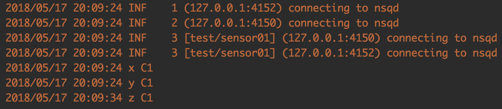
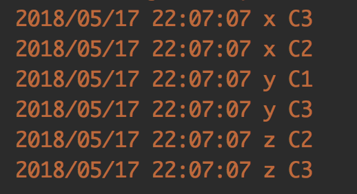

# 分布式实时消息平台NSQ


> NSQ是一个基于Go语言的分布式实时消息平台，它基于MIT开源协议发布，由bitly公司开源出来的一款简单易用的消息中间件。 NSQ可用于大规模系统中的实时消息服务，并且每天能够处理数亿级别的消息，其设计目标是为在分布式环境下运行的去中心化服务提供一个强大的基础架构。 NSQ具有分布式、去中心化的拓扑结构，该结构具有无单点故障、故障容错、高可用性以及能够保证消息的可靠传递的特征。NSQ非常容易配置和部署，且具有最大的灵活性，支持众多消息协议。


## NSQ组件

NSQ 由 3 个守护进程组成:

- nsqd 是接收、队列和传送消息到客户端的守护进程。

- nsqlookupd 是管理的拓扑信息，并提供了最终一致发现服务的守护进程。

- nsqadmin 是一个 Web UI 来实时监控集群(和执行各种管理任务)。


## NSQ架构


### topic消息的逻辑关键词

- topic 是 NSQ 消息发布的 逻辑关键词 ，可以理解为人为定义的一种消息类型。当程序初次发布带 topic 的消息时,如果 topic 不存在,则会在 nsqd 中创建。
- producer消息的生产者/发布者
- producer 通过 HTTP API 将消息发布到 nsqd 的指定 topic ，一般有 pub/mpub 两种方式， pub 发布一个消息， mpub 一个往返发布多个消息。
- producer 也可以通过 nsqd客户端 的 TCP接口 将消息发布给 nsqd 的指定 topic 。
- 当生产者 producer 初次发布带 topic 的消息给 nsqd 时,如果 topic 不存在，则会在 nsqd 中创建 topic 。

### channel消息传递的通道

- 当生产者每次发布消息的时候,消息会采用多播的方式被拷贝到各个 channel 中, channel 起到队列的作用。
- channel 与 consumer(消费者) 相关，是消费者之间的负载均衡,消费者通过这个特殊的channel读取消息。
- 在 consumer 想单独获取某个 topic 的消息时，可以 subscribe(订阅) 一个自己单独命名的 nsqd 中还不存在的 channel , nsqd 会为这个 consumer 创建其命名的 channel 。
- Channel 会将消息进行排列，如果没有 consumer 读取消息，消息首先会在内存中排队，当量太大时就会被保存到磁盘中。可以在配置中配置具体参数。
- 一个 channel 一般会有多个 consumer 连接。假设所有已连接的 consumer 处于准备接收消息的状态，每个消息将被传递到一个随机的 consumer 。
- Go语言中的channel是表达队列的一种自然方式，因此一个NSQ的topic/channel，其核心就是一个存放消息指针的Go-channel缓冲区。缓冲区的大小由 —mem-queue-size 配置参数确定。

### consumer消息的消费者

- consumer 通过 TCP subscribe 自己需要的 channel
- topic 和 channel 都没有预先配置。 topic 由第一次发布消息到命名 topic 的 producer 创建 或 第一次通过 subscribe 订阅一个命名 topic 的 consumer 来创建。 channel 被 consumer 第一次 subscribe 订阅到指定的 channel 创建。
- 多个 consumer subscribe 一个 channel ，假设所有已连接的客户端处于准备接收消息的状态，每个消息将被传递到一个 随机 的 consumer 。
- NSQ 支持延时消息， consumer 在配置的延时时间后才能接受相关消息。
- Channel在 consumer 退出后并不会删除，这点需要特别注意。


### 概述
1. NSQ推荐通过 nsqd 实例使用协同定位 producer ，这意味着即使面对网络分区，消息也会被保存在本地，直到它们被一个 consumer 读取。更重要的是， producer 不必去发现其他的 nsqd 节点，他们总是可以向本地 nsqd 实例发布消息。
2. 一个 producer 向它的本地 nsqd 发送消息，要做到这点，首先要先打开一个连接( NSQ 提供 HTTP API 和 TCP 客户端 等2种方式连接到 nsqd )，然后发送一个包含 topic 和消息主体的发布命令(pub/mpub/publish)，在这种情况下，我们将消息发布到 topic 上，消息会采用多播的方式被拷贝到各个 channel 中, 然后通过多个 channel 以分散到我们不同需求的 consumer 中。


3. channel 起到队列的作用。 多个 producer 产生的 topic 消息在每一个连接 topic 的 channel 上进行排队。
4. 每个 channel 的消息都会进行排队，直到一个 consumer 把他们消费，如果此队列超出了内存限制，消息将会被写入到磁盘中。 nsqd 节点首先会向 nsqlookup 广播他们的位置信息，一旦它们注册成功， consumer 将会从 nsqlookup 服务器节点上发现所有包含事件 topic 的 nsqd 节点。
5. 每个 consumer 向每个 nsqd 主机进行订阅操作，用于表明 consumer 已经准备好接受消息了。这里我们不需要一个完整的连通图，但我们必须要保证每个单独的 nsqd 实例拥有足够的消费者去消费它们的消息，否则 channel 会被队列堆着。


## 启动NSQ服务

### 启动 nsqlookupd

``` shell
nsqlookupd
``` 

客户端通过查询 nsqlookupd 来发现指定topic的生产者，并且 nsqd 节点广播 topic 和通道 channel 信息
该服务运行后有两个端口：TCP 接口，nsqd 用它来广播；HTTP 接口，客户端用它来发现和管理。
在生产环境中，为了高可用，最好部署三个nsqlookupd服务。


### 创建 nsqd 的数据路径

``` shell
mkdir /tmp/nsqdata1 /tmp/nsqdata2
``` 

### 运行两个测试的 nsqd 实例

``` shell
nsqd --lookupd-tcp-address=127.0.0.1:4160 -broadcast-address=127.0.0.1 -tcp-address=127.0.0.1:4150 -http-address=0.0.0.0:4151 -data-path=/tmp/nsqdata1

nsqd --lookupd-tcp-address=127.0.0.1:4160 -broadcast-address=127.0.0.1 -tcp-address=127.0.0.1:4152 -http-address=0.0.0.0:4153 -data-path=/tmp/nsqdata2
``` 

nsqd 可以独立运行，不过通常它是由 nsqlookupd 实例所在集群配置的(它在这能声明 topics 和 channels ，以便大家能找到)
服务启动后有两个端口：一个给客户端(TCP)，另一个是 HTTP API。还能够开启HTTPS。
同一台服务器启动多个 nsqd ，要注意端口和数据路径必须不同，包括： –lookupd-tcp-address 、 -tcp-address 、 –data-path 。
删除topic、channel需要HTTP API调用。

### 启动 nsqadmin 前端Web监控

``` shell
nsqadmin --lookupd-http-address=localhost:4161
``` 

nsqadmin 是一套 WEB UI ，用来汇集集群的实时统计，并执行不同的管理任务。
运行后，能够通过4171端口查看并管理 topic 和 channel 。
nsqadmin 通常只需要运行一个。

## 使用NSQ

### 测试1


- 2个Producer 1个Consumer
- produce1() 发布publish “x”,”y” 到 topic “test”
- produce2() 发布publish “z” 到 topic “test”
- consumer1() 订阅subscribe channel “sensor01” of topic “test”

```go
package test

import (
        "log"
        "time"
        "testing"
        "strconv"

        "github.com/nsqio/go-nsq"
)

func TestNSQ1(t *testing.T) {
       NSQDsAddrs := []string{"127.0.0.1:4150", "127.0.0.1:4152"}
       go consumer1(NSQDsAddrs)
       go produce1()
       go produce2()
       time.Sleep(30 * time.Second)
}

func produce1() {
        cfg := nsq.NewConfig()
        nsqdAddr := "127.0.0.1:4150"
        producer, err := nsq.NewProducer(nsqdAddr, cfg)
        if err != nil {
                log.Fatal(err)
        }
        if err := producer.Publish("test", []byte("x")); err != nil {
                log.Fatal("publish error: " + err.Error())
        }
        if err := producer.Publish("test", []byte("y")); err != nil {
                log.Fatal("publish error: " + err.Error())
        }
}

func produce2() {
        cfg := nsq.NewConfig()
        nsqdAddr := "127.0.0.1:4152"
        producer, err := nsq.NewProducer(nsqdAddr, cfg)
        if err != nil {
                log.Fatal(err)
        }
        if err := producer.Publish("test", []byte("z")); err != nil {
                log.Fatal("publish error: " + err.Error())
        }
}

func consumer1(NSQDsAddrs []string) {
        cfg := nsq.NewConfig()
        consumer, err := nsq.NewConsumer("test", "sensor01", cfg)
        if err != nil {
                log.Fatal(err)
        }
        consumer.AddHandler(nsq.HandlerFunc(
                func(message *nsq.Message) error {
                        log.Println(string(message.Body) + " C1")
                        return nil
                }))
        if err := consumer.ConnectToNSQDs(NSQDsAddrs); err != nil {
                log.Fatal(err, " C1")
        }
        <-consumer.StopChan
}

```


测试结果




x,y,z 都被 consumer1 接收了。注意到接收时间， x,y 几乎同时被接收，它们都由 producer1 发布，而 z 由 producer2 发布，中间间隔10秒。测试了很多次都是10秒,偶尔是15秒或20秒。查看了ConnectToNSQDs()

```go
// ConnectToNSQDs takes multiple nsqd addresses to connect directly to.
//
// It is recommended to use ConnectToNSQLookupd so that topics are discovered
// automatically.  This method is useful when you want to connect to local instance.

```

Consumer每隔x秒，向nsqlookud进行http轮询，用来更新自己的nsqd地址目录,当一个producer的channel一直没有数据时，则会轮询到下一个producer


### 测试2
- 1个Producer 3个Consumer
- produce3() 发布publish “x”,”y”,”z” 到 topic “test”
- consumer1() 订阅subscribe channel “sensor01” of topic “test”
- consumer2() 订阅subscribe channel “sensor01” of topic “test”
- consumer3() 订阅subscribe channel “sensor02” of topic “test”

```go
package test

import (
        "log"
        "time"
        "testing"
        "strconv"

        "github.com/nsqio/go-nsq"
)

func TestNSQ2(t *testing.T) {
        NSQDsAddrs := []string{"127.0.0.1:4150"}
        go consumer1(NSQDsAddrs)
        go consumer2(NSQDsAddrs)
        go consumer3(NSQDsAddrs)
        go produce3()
        time.Sleep(5 * time.Second)
}

func produce3() {
        cfg := nsq.NewConfig()
        nsqdAddr := "127.0.0.1:4150"
        producer, err := nsq.NewProducer(nsqdAddr, cfg)
        if err != nil {
                log.Fatal(err)
        }
        if err := producer.Publish("test", []byte("x")); err != nil {
                log.Fatal("publish error: " + err.Error())
        }
        if err := producer.Publish("test", []byte("y")); err != nil {
                log.Fatal("publish error: " + err.Error())
        }
        if err := producer.Publish("test", []byte("z")); err != nil {
                log.Fatal("publish error: " + err.Error())
        }
}

func consumer1(NSQDsAddrs []string) {
        cfg := nsq.NewConfig()
        consumer, err := nsq.NewConsumer("test", "sensor01", cfg)
        if err != nil {
                log.Fatal(err)
        }
        consumer.AddHandler(nsq.HandlerFunc(
                func(message *nsq.Message) error {
                        log.Println(string(message.Body) + " C1")
                        return nil
                }))
        if err := consumer.ConnectToNSQDs(NSQDsAddrs); err != nil {
                log.Fatal(err, " C1")
        }
        <-consumer.StopChan
}

func consumer2(NSQDsAddrs []string) {
        cfg := nsq.NewConfig()
        consumer, err := nsq.NewConsumer("test", "sensor01", cfg)
        if err != nil {
                log.Fatal(err)
        }
        consumer.AddHandler(nsq.HandlerFunc(
                func(message *nsq.Message) error {
                        log.Println(string(message.Body) + " C2")
                        return nil
                }))
        if err := consumer.ConnectToNSQDs(NSQDsAddrs); err != nil {
                log.Fatal(err, " C2")
        }
        <-consumer.StopChan
}

func consumer3(NSQDsAddrs []string) {
        cfg := nsq.NewConfig()
        consumer, err := nsq.NewConsumer("test", "sensor02", cfg)
        if err != nil {
                log.Fatal(err)
        }
        consumer.AddHandler(nsq.HandlerFunc(
                func(message *nsq.Message) error {
                        log.Println(string(message.Body) + " C3")
                        return nil
                }))
        if err := consumer.ConnectToNSQDs(NSQDsAddrs); err != nil {
               log.Fatal(err, " C3")
        }
        <-consumer.StopChan
}

```

测试结果:





- consumer1 接收到了 y
- consumer2 接收到了 x,z
- consumer3 接收到了 x,y,z
- channel sensor01 中的消息被随机的分到了 consumer1 和 consumer2
- consumer3 单独占有 channel sensor02 ，接收了其中的所有消息


