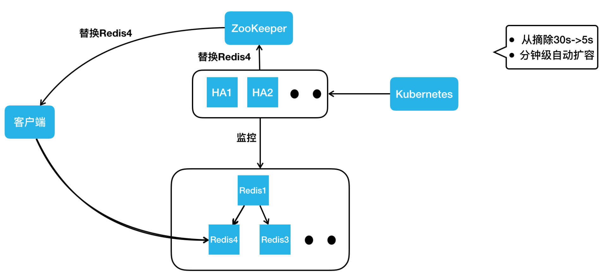
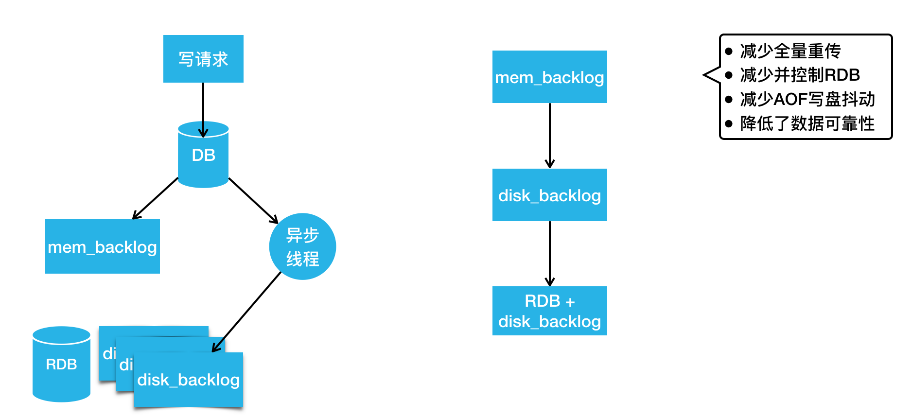

# 美团万亿级 KV 存储架构与实践

KV 存储作为美团一项重要的在线存储服务，承载了在线服务每天万亿级的请求量。在 2019 年 QCon 全球软件开发大会（上海站）上，美团高级技术专家齐泽斌分享了《美团点评万亿级 KV 存储架构与实践》，本文系演讲内容的整理，主要分为四个部分：第一部分讲述了美团 KV 存储的发展历程；第二部分阐述了内存 KV Squirrel 架构和实践；第三部分介绍了持久化 KV Cellar 架构和实践；最后分享了未来的发展规划和业界新趋势。

## 美团点评 KV 存储发展历程

美团第一代的分布式 KV 存储如下图左侧的架构所示，相信很多公司都经历过这个阶段。在客户端内做一致性哈希，在后端部署很多的 Memcached 实例，这样就实现了最基本的 KV 存储分布式设计。但这样的设计存在很明显的问题：比如在宕机摘除节点时，会丢数据，缓存空间不够需要扩容，一致性哈希也会丢失一些数据等等，这样会给业务开发带来的很多困扰。

随着 Redis 项目的成熟，美团也引入了 Redis 来解决我们上面提到的问题，进而演进出来如上图右侧这样一个架构。大家可以看到，客户端还是一样，采用了一致性哈希算法，服务器端变成了 Redis 组成的主从结构。当任何一个节点宕机，我们可以通过 Redis 哨兵完成 Failover，实现高可用。但有一个问题还是没有解决，如果扩缩容的话，一致性哈希仍然会丢数据，那么这个问题该如何解决呢？

这个时候，我们发现有了一个比较成熟的 KV 存储开源项目：阿里 Tair 。2014年，我们引入了 Tair 来满足业务 KV 存储方面的需求。Tair 开源版本的架构主要分成三部分：上图下边是存储节点，存储节点会上报心跳到它的中心节点，中心节点内部有两个配置管理节点，会监控所有的存储节点。当有任何存储节点宕机或者扩容时，它会做集群拓扑的重新构建。当客户端启动时，它会直接从中心节点拉来一个路由表。这个路由表简单来说就是一个集群的数据分布图，客户端根据路由表直接去存储节点读写。针对之前 KV 的扩容丢数据问题，它也有数据迁移机制来保证数据的完整性。

但是，我们在使用的过程中，还遇到了一些其他问题，比如中心节点虽然是主备高可用的，但实际上它没有类似于分布式仲裁的机制，所以在网络分割的情况下，它是有可能发生“脑裂”的，这个也给我们的业务造成过比较大的影响。另外，在容灾扩容时，也遇到过数据迁移影响到业务可用性的问题。另外，我们之前用过 Redis ，业务会发现 Redis 的数据结构特别丰富，而 Tair 还不支持这些数据结构。虽然我们用 Tair 解决了一些问题，但是 Tair 也无法完全满足业务需求。毕竟，在美团这样一个业务规模较大和业务复杂度较高的场景下，很难有开源系统能很好地满足我们的需求。最终，我们决定在已应用的开源系统之上进行自研。

刚好在2015 年， Redis 官方正式发布了集群版本 Redis Cluster。所以，我们紧跟社区步伐，并结合内部需求做了很多开发工作，演进出了全内存、高吞吐、低延迟的 KV 存储 Squirrel。另外，基于 Tair，我们还加入了很多自研的功能，演进出持久化、大容量、数据高可靠的 KV 存储 Cellar 。因为 Tair 的开源版本已经有四五年没有更新了，所以，Cellar 的迭代完全靠美团自研，而 Redis 社区一直很活跃。总的来说，Squirrel 的迭代是自研和社区并重，自研功能设计上也会尽量与官方架构进行兼容。后面大家可以看到，因为这些不同，Cellar 和 Squirrel 在解决同样的问题时也选取了不同的设计方案。

这两个存储其实都是 KV 存储领域不同的解决方案。在实际应用上，如果业务的数据量小，对延迟敏感，我们建议大家用 Squirrel ；如果数据量大，对延迟不是特别敏感，我们建议用成本更低的 Cellar 。目前这两套 KV 存储系统在美团内部每天的调用量均已突破万亿，它们的请求峰值也都突破了每秒亿级。

## 内存 KV Squirrel 架构和实践

在开始之前，本文先介绍两个存储系统共通的地方。比如分布式存储的经典问题：数据是如何分布的？这个问题在 KV 存储领域，就是 Key 是怎么分布到存储节点上的。这里 Squirrel 跟 Cellar 是一样的。当我们拿到一个 Key 后，用固定的哈希算法拿到一个哈希值，然后将哈希值对 Slot 数目取模得到一个Slot id，我们两个 KV 现在都是预分片16384个 Slot 。得到 Slot id 之后，再根据路由表就能查到这个 Slot 存储在哪个存储节点上。这个路由表简单来说就是一个 Slot 到存储节点的对照表。

接下来讲一下对高可用架构的认知，个人认为高可用可以从宏观和微观两个角度来看。从宏观的角度来看，高可用就是指容灾怎么做。比如说挂掉了一个节点，你该怎么做？一个机房或者说某个地域的一批机房宕机了，你该怎么做？而从微观的角度看，高可用就是怎么能保证端到端的高成功率。我们在做一些运维升级或者扩缩容数据迁移的时候，能否做到业务请求的高可用？ 本文也会从宏观和微观两个角度来分享美团做的一些高可用工作。

上图就是我们的 Squirrel 架构。中间部分跟 Redis 官方集群是一致的。它有主从的结构， Redis 实例之间通过 Gossip 协议去通信。我们在右边添加了一个集群调度平台，包含调度服务、扩缩容服务和高可用服务等，它会去管理整个集群，把管理结果作为元数据更新到 ZooKeeper。我们的客户端会订阅 ZooKeeper 上的元数据变更，实时获取到集群的拓扑状态，直接在 Redis 集群进行读写操作。

## Squirrel 节点容灾

然后再看一下 Squirrel 容灾怎么做。对于 Redis 集群而言，节点宕机已经有完备的处理机制了。官方提供的方案，任何一个节点从宕机到被标记为 FAIL 摘除，一般需要经过 30 秒。主库的摘除可能会影响数据的完整性，所以，我们需要谨慎一些。但是对于从库呢？我们认为这个过程完全没必要。另一点，我们都知道内存的 KV 存储数据量一般都比较小。对于业务量很大的公司来说，它往往会有很多的集群。如果发生交换机故障，会影响到很多的集群，宕机之后去补副本就会变得非常麻烦。为了解决这两个问题，我们做了 HA 高可用服务。

它的架构如下图所示，它会实时监控集群的所有节点。不管是网络抖动，还是发生了宕机（比如说 Redis 2 ），它可以实时更新 ZooKeeper ，告诉 ZooKeeper 去摘除 Redis 2 ，客户端收到消息后，读流量就直接路由到 Redis 3上。如果 Redis 2 只是几十秒的网络抖动，过几十秒之后，如果 HA 节点监控到它恢复后，会把它重新加回。

如果过了一段时间，HA 判断它属于一个永久性的宕机，HA 节点会直接从 Kubernetes 集群申请一个新的 Redis 4 容器实例，把它加到集群里。此时，拓扑结构又变成了一主两从的标准结构，HA 节点更新完集群拓扑之后，就会去写 ZooKeeper 通知客户端去更新路由，客户端就能到 Redis 4 这个新从库上进行读操作。

通过上述方案，我们把从库的摘除时间从 30 秒降低到了 5 秒。另外，我们通过 HA 自动申请容器实例加入集群的方式，把宕机补副本变成了一个分钟级的自动操作，不需要任何人工的介入。

## Squirrel 跨地域容灾

我们解决了单节点宕机的问题，那么跨地域问题如何解决呢？我们首先来看下跨地域有什么不同。第一，相对于同地域机房间的网络而言，跨地域专线很不稳定；第二，跨地域专线的带宽是非常有限且昂贵的。而集群内的复制没有考虑极端的网络环境。假如我们把主库部署到北京，两个从库部署在上海，同样一份数据要在北上专线传输两次，这样会造成巨大的专线带宽浪费。另外，随着业务的发展和演进，我们也在做单元化部署和异地多活架构。用官方的主从同步，满足不了我们的这些需求。基于此，我们又做了集群间的复制方案。

如上图所示，这里画出了北京的主集群以及上海的从集群，我们要做的是通过集群同步服务，把北京主集群的数据同步到上海从集群上。按照流程，首先要向我们的同步调度模块下发“在两个集群间建立同步链路”的任务，同步调度模块会根据主从集群的拓扑结构，把主从集群间的同步任务下发到同步集群，同步集群收到同步任务后会扮成 Redis 的 Slave，通过 Redis 的复制协议，从主集群上的从库拉取数据，包括 RDB以及后续的增量变更。同步机收到数据后会把它转成客户端的写命令，写到上海从集群的主节点里。通过这样的方式，我们把北京主集群的数据同步到了上海的从集群。同样的，我们要做异地多活也很简单，再加一个反向的同步链路，就可以实现集群间的双向同步。

接下来我们讲一下如何做好微观角度的高可用，也就是保持端到端的高成功率。对于 Squirrel ，主要讲如下三个影响成功率的问题：

- 数据迁移造成超时抖动。
- 持久化造成超时抖动。
- 热点 Key 请求导致单节点过载。
- Squirrel 智能迁移
对于数据迁移，我们主要遇到三个问题：

- Redis Cluster 虽然提供了数据迁移能力，但是对于要迁哪些 Slot，Slot 从哪迁到哪，它并不管。
- 做数据迁移的时候，大家都想越快越好，但是迁移速度过快又可能影响业务正常请求。
- Redis 的 Migrate 命令会阻塞工作线程，尤其在迁移大 Value 的时候会阻塞特别久。
为了解决这些问题，我们做了全新的迁移服务。

下面我们按照工作流，讲一下它是如何运行的。首先生成迁移任务，这步的核心是“就近原则”，比如说同机房的两个节点做迁移肯定比跨机房的两个节点快。迁移任务生成之后，会把任务下发到一批迁移机上。迁移机迁移的时候，有这样几个特点：

- 第一，会在集群内迁出节点间做并发，比如同时给 Redis 1、Redis 3 下发迁移命令。
- 第二，每个 Migrate 命令会迁移一批 Key。
- 第三，我们会用监控服务去实时采集客户端的成功率、耗时，服务端的负载、QPS 等，之后把这个状态反馈到迁移机上。迁移数据的过程就类似 TCP 慢启动的过程，它会把速度一直往上加，若出现请求成功率下降等情况，它的速度就会降低，最终迁移速度会在动态平衡中稳定下来，这样就达到了最快速的迁移，同时又尽可能小地影响业务的正常请求。
接下来，我们看一下大 Value 的迁移，我们实现了一个异步 Migrate 命令，该命令执行时，Redis 的主线程会继续处理其他的正常请求。如果此时有对正在迁移 Key 的写请求过来，Redis 会直接返回错误。这样最大限度保证了业务请求的正常处理，同时又不会阻塞主线程。

## Squirrel 持久化重构

Redis 主从同步时会生成 RDB。生成 RDB 的过程会调用 Fork 产生一个子进程去写数据到硬盘，Fork 虽然有操作系统的 COW 机制，但是当内存用量达到 10 G 或 20 G 时，依然会造成整个进程接近秒级的阻塞。这对在线业务来说几乎是无法接受的。我们也会为数据可靠性要求高的业务去开启 AOF，而开 AOF 就可能因 IO 抖动造成进程阻塞，这也会影响请求成功率。对官方持久化机制的这两个问题，我们的解决方案是重构持久化机制。

上图是我们最新版的 Redis 持久化机制，写请求会先写到 DB 里，然后写到内存 Backlog，这跟官方是一样的。同时它会把请求发给异步线程，异步线程负责把变更刷到硬盘的 Backlog 里。当硬盘 Backlog 过多时，我们会主动在业务低峰期做一次 RDB ，然后把 RDB 之前生成的 Backlog 删除。

如果这时候我们要做主从同步，去寻找同步点的时候，该怎么办？第一步还是跟官方一样，我们会从内存 Backlog 里找有没有要求的同步点，如果没有，我们会去硬盘 Backlog 找同步点。由于硬盘空间很大，硬盘 Backlog 可以存储特别多的数据，所以很少会出现找不到同步点的情况。如果硬盘 Backlog 也没有，我们就会触发一次类似于全量重传的操作，但这里的全量重传是不需要当场生成 RDB 的，它可以直接用硬盘已存的 RDB 及其之后的硬盘 Backlog 完成全量重传。通过这个设计，我们减少了很多的全量重传。另外，我们通过控制在低峰区生成 RDB ，减少了很多 RDB 造成的抖动。同时，我们也避免了写 AOF 造成的抖动。不过，这个方案因为写 AOF 是完全异步的，所以会比官方的数据可靠性差一些，但我们认为这个代价换来了可用性的提升，这是非常值得的。

## Squirrel 热点 Key

下面看一下 Squirrel 的热点 Key 解决方案。如下图所示，普通主、从是一个正常集群中的节点，热点主、从是游离于正常集群之外的节点。我们看一下它们之间怎么发生联系。

当有请求进来读写普通节点时，节点内会同时做请求 Key 的统计。如果某个 Key 达到了一定的访问量或者带宽的占用量，会自动触发流控以限制热点 Key 访问，防止节点被热点请求打满。同时，监控服务会周期性的去所有 Redis 实例上查询统计到的热点 Key。如果有热点，监控服务会把热点 Key 所在 Slot 上报到我们的迁移服务。迁移服务这时会把热点主从节点加入到这个集群中，然后把热点 Slot 迁移到这个热点主从上。因为热点主从上只有热点 Slot 的请求，所以热点 Key的处理能力得到了大幅提升。通过这样的设计，我们可以做到实时的热点监控，并及时通过流控去止损；通过热点迁移，我们能做到自动的热点隔离和快速的容量扩充。

