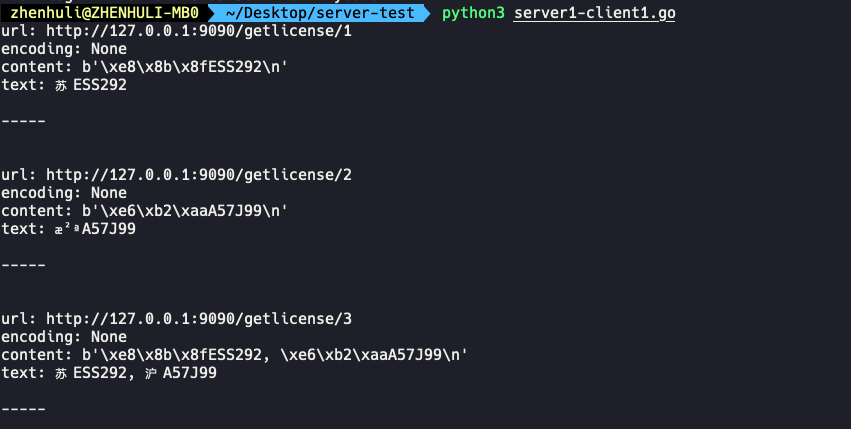

# 震惊！Python的requests库竟然有这么异想不到的表现

> 最近开发一个新功能，功能的大概就是识别视频中的车辆信息：通过将视频上传到[明瞳智控（ISS）](https://console.cloud.tencent.com/iss), 通过强大的云计算能力将视频中的车牌信息分析出来，通过CGI返回给客户，用户可以用来做相应的分析和统计。

> 功能开发好了，要给客户体验一下，为了体现咱们 CSIG ToB 工程师服务到家的态度，当然要给用户写一个简单的Python测试程序呀，用户可以拿过来直接上手体验就OK了，也不用去考虑计算签名啥的乱七八糟的东西。（我真是太贴心了，给自己点个赞）

## 一、 场景复现：自己测试着好好的，为什么别人一用Python来测试就完蛋了呢


### 1. server 端

server1.go 示例程序：（只是一个复现的server程序，线上肯定不会这样写，要不然同事肯定要打死我）

```go

package main

import (
	"fmt"
	"log"
	"net/http"

	"github.com/julienschmidt/httprouter"
)

func getlicense(w http.ResponseWriter, r *http.Request, ps httprouter.Params) {
	header := w.Header()
	header.Set("Content-Type", "application/xml")

	number := ps.ByName("number")
	if number == "1" {
		fmt.Fprintf(w, "苏ESS292\n")
	} else if number == "2" {
		fmt.Fprintf(w, "沪A57J99\n")
	} else if number == "3" {
		fmt.Fprintf(w, "苏ESS292, 沪A57J99\n")
	}
}

func main() {
	router := httprouter.New()
	router.GET("/getlicense/:number", getlicense)
	log.Fatal(http.ListenAndServe(":9090", router))
}

```


### 2 PythonClient

用python脚本分别测试三个请求：但是三个请求竟然惊人的不一致

server1-client1.py

```python


import requests

url = "http://127.0.0.1:9090/getlicense/1"
r = requests.get(url)
print ("url:", url)
print ("encoding:", r.encoding)
print ("content:", r.content)
print ("text:", str(r.text))
print ("-----\n\n")

url = "http://127.0.0.1:9090/getlicense/2"
r = requests.get(url)
print ("url:", url)
print ("encoding:", r.encoding)
print ("content:", r.content)
print ("text:", str(r.text))
print ("-----\n\n")

url = "http://127.0.0.1:9090/getlicense/3"
r = requests.get(url)
print ("url:", url)
print ("encoding:", r.encoding)
print ("content:", r.content)
print ("text:", str(r.text))
print ("-----\n\n")


```


```shell

go run server1.go

python3 server1-client1.go

```

输出：




> 运行会发现，在任何编码都不改变的时候，只有第二个乱码了，也就是只有 沪A57J99，到底这个有啥特殊的呢。

## 二、抓网络包、分析requests库源码


## 三、写两个简单的 Server 和 Client 来对照一下。

server.go

```go


```


client.py

```python


```


## 四、python chardet 是干啥的

chardet_test.py


```python

import chardet

a = b'\xe6\x9d\x8e' #李
print(chardet.detect(a))

a = b'\xe5\x86\x80' #冀
print(chardet.detect(a))

a = b'\xe5\x86\x80' #冀
print(chardet.detect(a))

a = b'\xe6\xb2\xaa' #沪
print(chardet.detect(a))

a = b'\xe6\xb2\xaa \xe6\xb2\xaa' #沪沪
print(chardet.detect(a))

a = b'\xe6\xb2\xaa \xe6\xb2\xaa \xe6\xb2\xaa' #沪沪沪
print(chardet.detect(a))

a = b'\xe6\xb2\xaa \xe6\xb2\xaa \xe6\xb2\xaa \xe6\xb2\xaa' #沪沪沪沪
print(chardet.detect(a))


```

执行：

```shell

python3 chardet_test.py

```

输出：

```shell

{'encoding': 'utf-8', 'confidence': 0.505, 'language': ''}


{'encoding': 'Windows-1252', 'confidence': 0.73, 'language': ''}


{'encoding': 'Windows-1252', 'confidence': 0.73, 'language': ''}


{'encoding': 'ISO-8859-1', 'confidence': 0.73, 'language': ''}


{'encoding': 'utf-8', 'confidence': 0.7525, 'language': ''}


{'encoding': 'utf-8', 'confidence': 0.87625, 'language': ''}


{'encoding': 'utf-8', 'confidence': 0.938125, 'language': ''}

```


## 总结：

原因竟然是这样的：好家伙，我直接好家伙