# 明瞳智控ISS，感受别样的安防监控上云体验

> 明瞳智控（Intelligent Surveillance Storage，ISS）是腾讯云面向监控数据提供的存储及多模态分析一体化产品。该产品能够把监控内容快速接入公有云，实现数据存储、智能分析、基础处理、实时播放、监控回看等功能，可以满足智慧课堂、物流仓储、智慧零售、安防监控等场景。 

近年来，在平安城市、雪亮工程、智安小区等政策的扶持下，安防监控逐渐成为市场的新增长点。而云计算、大数据、智能AI等技术，也为安防监控领域的技术提升、智能化改革提供了强大的支持。

视频监控数据一般存储在本地的NVR设备中，这些设备可能分布在全国各地不同城市的机房中，企业需要对这些设备进行运维和管控，比如设备需要维修、过保替换等等。同时企业可能需要对这些视频数据做分析处理，或者引入一些AI的能力，这些对企业来说都存在挑战。


日前，```腾讯云明瞳智控ISS``` 推出RTMP协议推流功能，可以直接将网络摄像机的视频数据**上传到COS**上，可同时**进行转码、截图、AI分析处理**，无需购买NVR等存储设备，即可轻松实现安防监控数据上云。同时可以**实时播放**推送的数据流，对**历史数据进行检索和回看**。


## 一、明瞳智控ISS 产品业务架构

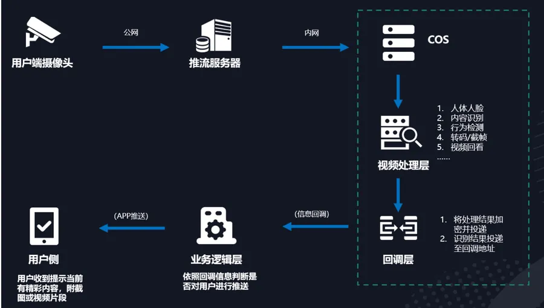

用户只需要通过**RTMP推流协议**，通过公网网络将视频数据推送至**COS RTMP服务器**，COS RTMP服务器根据用户推流通道配置，对数据进行**分片**，并将分片数据存储至COS存储桶。之后可以根据预设配置，**异步触发对应的媒体处理能力**。同时处理结果可以通过**回调形式通知给用户**。


## 二、安防监控如何快速上云


### 1. 开通相应园区的COS-Bucket

登录COS控制台创建相应园区的Bucket，通过RTMP协议推送的数据都会存储在这个Bucket下。建议根据地域就近接入，具有更佳的时延体验。

https://console.cloud.tencent.com/cos5/bucket

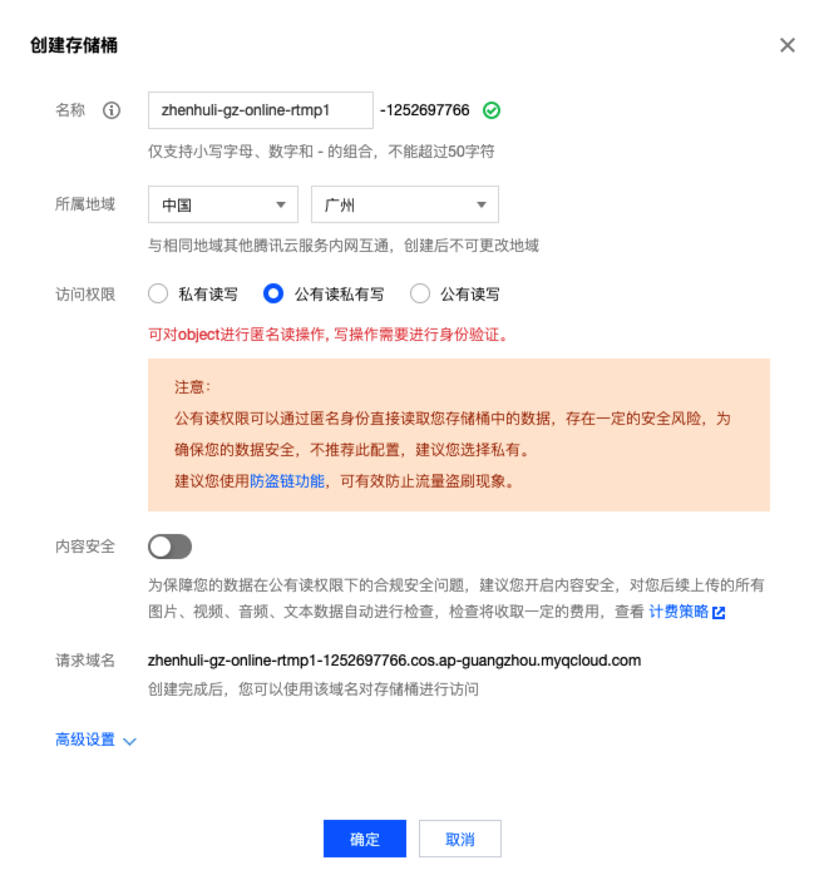

因为这个功能目前还在内测灰度中，大家想要上手实操，直接把创建好的Bucket通过工单/企业微信形式来联系我们就好啦。我们第一时间为您服务。


### 2. 首次使用需授权明瞳智控相应的角色

https://console.cloud.tencent.com/iss

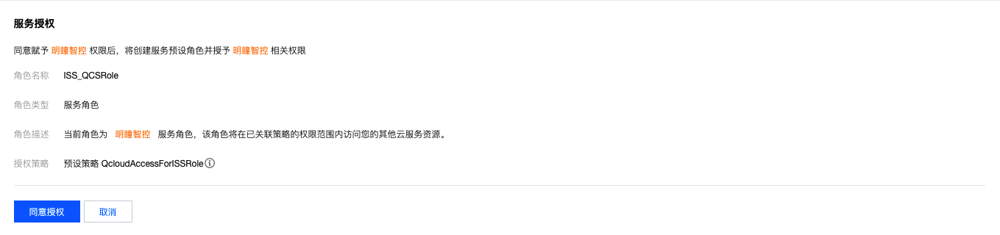

新账号打开链接，点击授权即可。

具有相应的角色和权限，系统才有权限往COS-Bucket里写入数据。


### 3. 创建项目

```明瞳智控ISS``` 目前有两种接入方式： **HTTP** 和 **RTMP** 。后续我们会陆续支持**GB28181协议的摄像头**直接接入，敬请期待。


这里我们在创建项目的时候选择**RTMP协议**的方式接入。并选择刚才我们已经创建好的COS-Bucket，路径选择 ```/``` 路径即可。

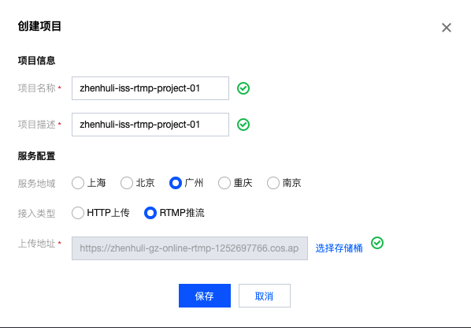


创建完成后，点击 ```启用``` 开启项目：

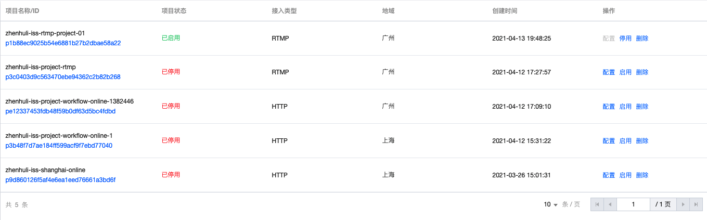


### 4. 创建流（Stream）

来到```项目监控```，选择刚才创建的项目，创建流即可。

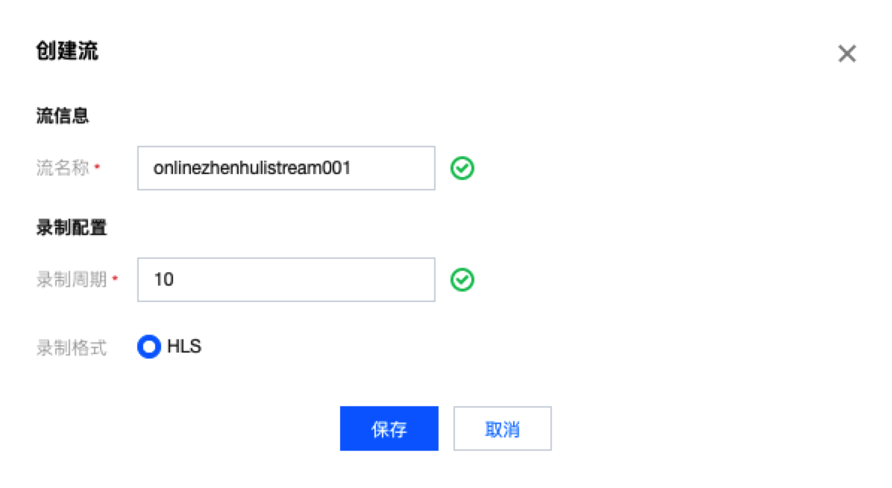

在控制台创建```流（Stream）```成功后，系统会自动分配一个**RTMP推流地址**和**实时播放地址**。接下来就可以通过这两个地址来进行推流和实时播放啦。

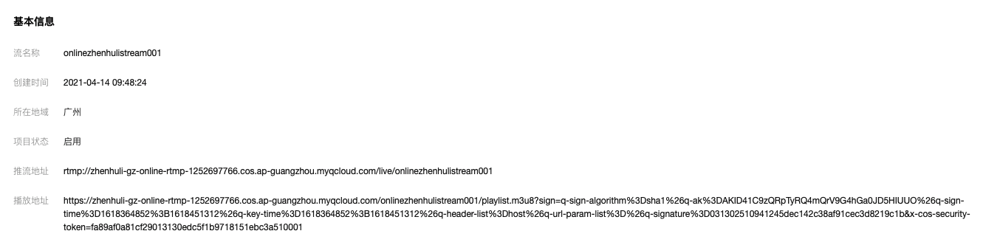


#### 4.1 为什么要创建流（Stream）？

- ```流（Stream）```就相当于一个**通道**，只有通过这个通道，才能通过RTMP协议进行上传。
- ```流（Stream）```在COS上实际上对应着一个**目录**，通过该Stream推送的视频流都会放在该目录下。（接下来演示中可以看到）
- ```流（Stream）```中可以配置：**数据的存储格式**、**M3U8中索引TS文件的数量**、**单个TS文件切片时长**。


#### 4.2 什么是HLS录制格式


```HLS（Http Live Streaming）```是由Apple公司定义的用于实时流传输的协议，HLS基于HTTP协议实现，传输内容包括两部分：一是M3U8描述文件，二是TS媒体文件。

一个简单的m3u8文件内容示例：
```

#EXTM3U
#EXT-X-VERSION:3
#EXT-X-MEDIA-SEQUENCE:11
#EXT-X-TARGETDURATION:10
#EXTINF:10.001,
1618297566989_1_10001.ts
#EXTINF:10.010,
1618297576981_1_10010.ts
#EXTINF:6.390,
1618297586982_1_6390.ts

```

客户端在拿到m3u8的文件内容时，会解析出ts文件的相对路径，自动去COS拉取对应的ts文件，实现视频流播放。目前Safari就支持播放HLS格式的视频。


#### 4.3 录制周期的含义

录制周期指的是每个ts切片的时间长度。
简单来说，通过RTMP上传会在COS会这样将数据存储下来
- 一种是ts文件，对应具体的视频数据
- 另一个是m3u8，用于索引ts文件，用于实时播放与查看。


假如当前通过RTMP推流30S，录制周期为10S，那么就会在COS上存储3个10S长度ts的切片和一个m3u8文件。

1). m3u8和ts文件的索引如下（图中为毫秒时间戳命名ts文件，录制周期为10S）：

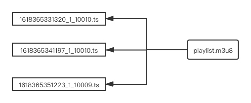


2). 假如继续推流10S呢，m3u8文件会自动更新，重新指向最新的ts文件，m3u8和ts文件的索引如下（图中为毫秒时间戳命名ts文件，录制周期为10S）：

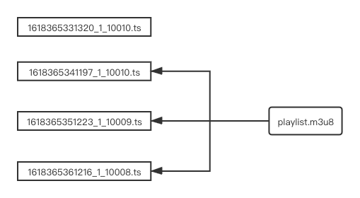


3). 假如继续推流20S呢，m3u8文件会持续自动更新，重新指向最新的ts文件，m3u8和ts文件的索引如下（图中为毫秒时间戳命名ts文件，录制周期为10S）：

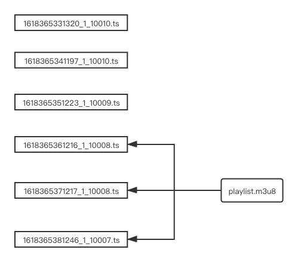


4). 因为 ```playlist.m3u8```总是指向最新的ts文件，那怎么实现历史视频的回看呢？只需要生成一个m3u8文件把历史ts文件重新索引起来就可以啦。在下图中我用开始时间、结束时间来标示一个m3u8回看链接。


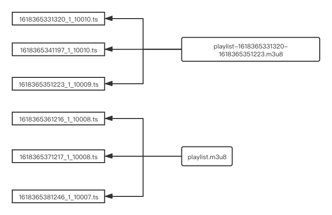


------


### 5. 如何模拟RTMP推流


拿到RTMP推送链接，就可以通过OBS客户端或者ffmpeg命令行就可以推流了，这个我使用 **肖邦的华丽大圆舞曲** 作为素材推送一下（不得不说，肖邦真是一个钢琴诗人）。


替换下方的secret_id，secret_key，使用python命令行推送视频流即可，代码地址在这里啦 https://git.code.oa.com/zhenhuli/iss_rtmp

```
python3 iss_rtmp.py secret_id secret_key ap-guangzhou zhenhuli-gz-online-rtmp-1252697766 onlinezhenhulistream001 /Users/zhenhuli/piano/华丽大圆舞曲-肖邦.mp4
```


### 6. 控制台查看自己推流的数据

1). 实时播放：

https://zhenhuli-gz-online-rtmp-1252697766.cos.ap-guangzhou.myqcloud.com/onlinezhenhulistream001/playlist.m3u8

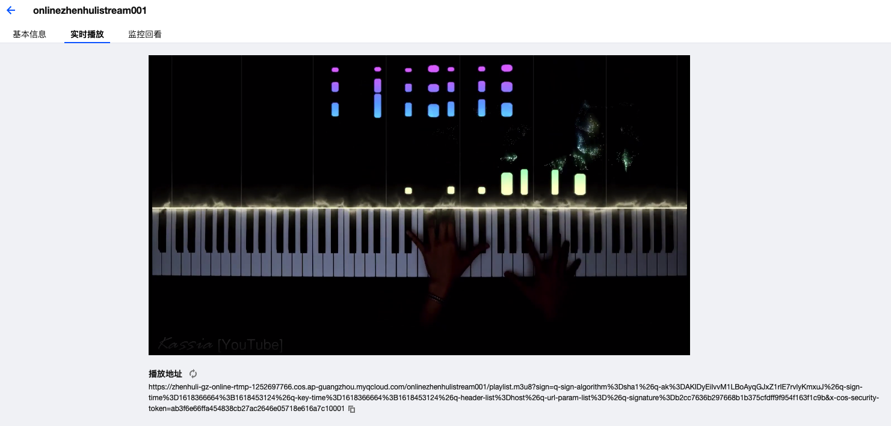


2). 监控回看：

选择相应的时间段生成回看链接即可，打开Safari就可以直接回看啦。（快来点击链接欣赏**肖邦的华丽大圆舞曲**吧）

https://zhenhuli-gz-online-rtmp-1252697766.cos.ap-guangzhou.myqcloud.com/onlinezhenhulistream001/1618362000-1618365600-playlist.m3u8

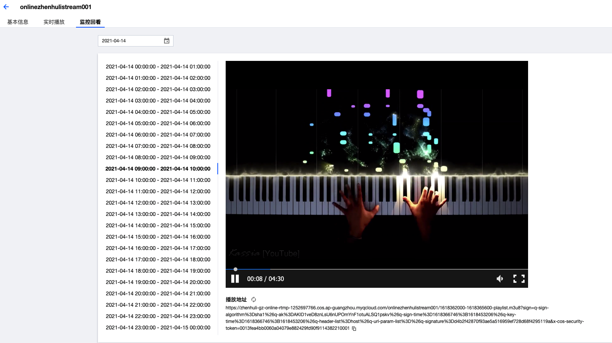


### 7. 对上传的视频文件进行数据处理

怎样对上传的视频进行**转码、截图、AI分析处理**呢：ISS允许用户创建自己的媒体处理模板，大家只需要定义好数据的处理规则（截图规则、图片的输出路径、输出文件名），并绑定到相应的流（Stream）即可。接下来简单演示推流截图功能：


#### 7.1 创建截图模板：定义截图间隔

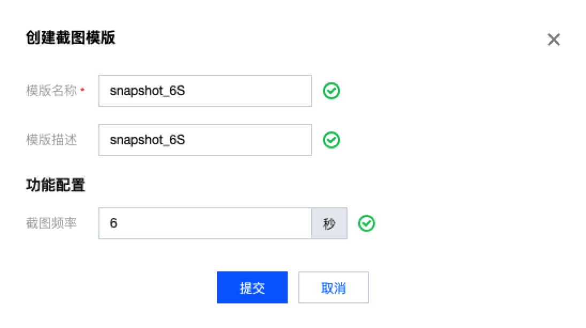

#### 7.2 绑定截图模板到流地址：确定截图的输出路径

在这里我单独生成到一个截图目录下 /onlinezhenhulistream001-snapshot

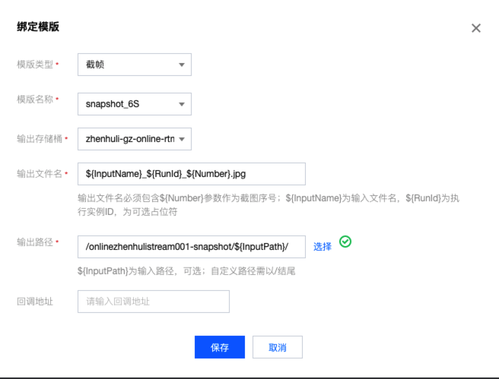

#### 7.3 开启截图模板，等待一段时间，会发现截图已经生成在COS上啦，是不是超级简单啦。

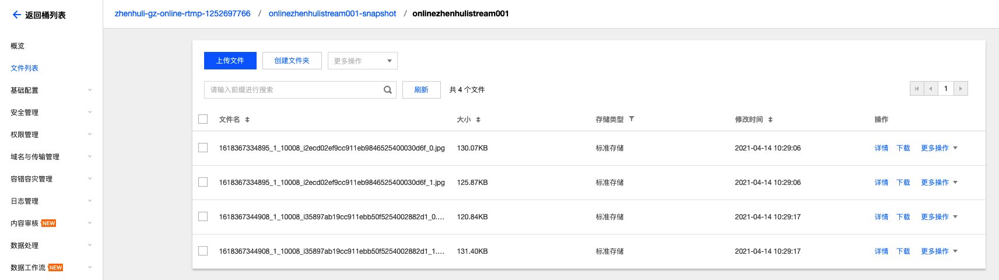


## 三、如何优化自己的存储成本


对大多数情况来说，伴随这时间的增长，安防监控的价值会越来越低，价值低的数据占有的存储成本将会越来越高。

那如何来淘汰历史低价值的数据呢，用户自己写程序定时来清除自己的数据么？这样也太低效了吧！

当然不会啦，贴心的COS给大家准备了**生命周期和自动沉降**的功能。

对象存储 COS 会按照您**设定的规则**对**指定对象**在指定的时间内自动进行**存储类型转换或删除**。

具体详情戳这里就可以啦：https://cloud.tencent.com/document/product/436/14605


## 四、明瞳智控ISS后续规划

- 支持**GB28181协议的摄像头**直接接入。
- 提供**工作流处理**，```截图/转码/AI``` 等任务的```并行/串行```处理功能。
- **截图分析功能**：通过对视频进行截图，再进行AI分析，识别 ```婴儿 宠物 车辆``` 等。


