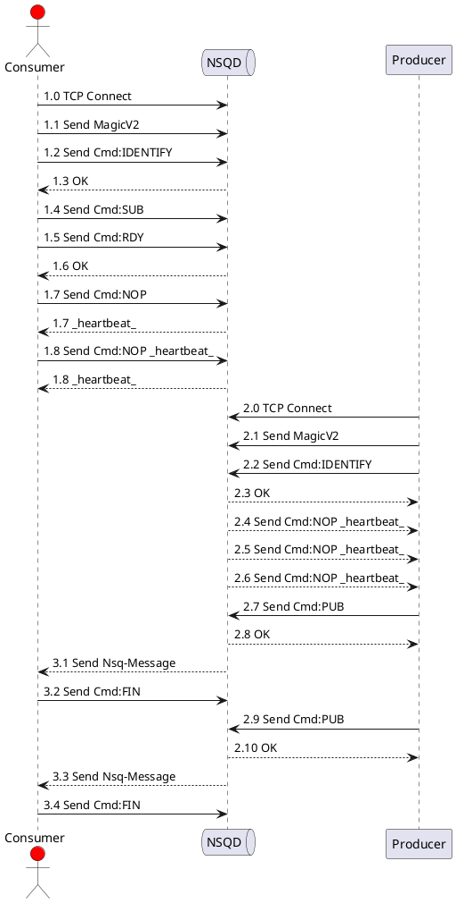
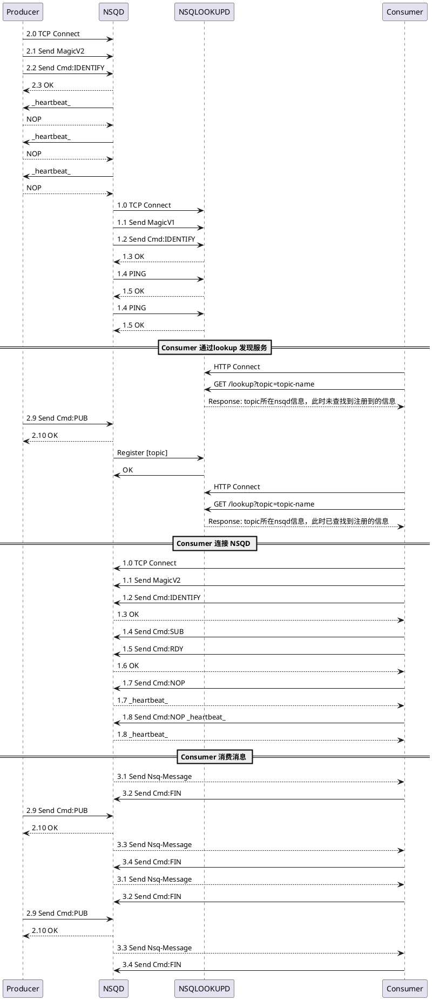

# Nsq学习笔记


> [!TIP|style:flat|label:引言]
>
> NSQ是一个基于Go语言的分布式实时消息平台，它基于MIT开源协议发布，由bitly公司开源出来的一款简单易用的消息中间件。
>
> NSQ可用于大规模系统中的实时消息服务，并且每天能够处理数亿级别的消息，其设计目标是为在分布式环境下运行的去中心化服务提供一个强大的基础架构。
>
> NSQ具有分布式、去中心化的拓扑结构，该结构具有无单点故障、故障容错、高可用性以及能够保证消息的可靠传递的特征。NSQ非常容易配置和部署，且具有最大的灵活性，支持众多消息协议。
>
> 123132

https://www.jianshu.com/p/f3500554f41c


# 

- nsq_to_nsq
  - nsq客户端读取(消费)指定topic/channel数据,然后通过均衡策略由生产者再次发送


```go
package main

import (
	"flag"
	"fmt"
	"io"
	"net"
	"os"
	"time"

	"github.com/nsqio/go-nsq"
)

func main() {
	cosumser_gonsq()
}

func cosumser_gonsq() {
	// nsqd http address
	topic := ""
	channel := ""
	flag.StringVar(&topic, "t", "topic-1", "1")
	flag.StringVar(&channel, "c", "channel-1", "2")
	flag.Parse()

	NSQDsAddrs := []string{"127.0.0.1:4150"}
	go consumer(NSQDsAddrs, topic, channel)
	// go consumer(NSQDsAddrs, "topic-1", "channel-2")
	time.Sleep(30 * time.Minute)
}


/*
nsqlookupd

mkdir dataa
mkdir datab

nsqd --lookupd-tcp-address=127.0.0.1:4160 -broadcast-address=127.0.0.1 -tcp-address=127.0.0.1:4150 -http-address=0.0.0.0:4151 -data-path=./dataa
nsqd --lookupd-tcp-address=127.0.0.1:4160 -broadcast-address=127.0.0.1 -tcp-address=127.0.0.1:4152 -http-address=0.0.0.0:4153 -data-path=./datab

 nsqadmin --lookupd-http-address=localhost:4161

 http://127.0.0.1:4171
*/

func consumer(NSQDsAddrs []string, topic string, channel string) {
	cfg := nsq.NewConfig()
	consumer, err := nsq.NewConsumer(topic, channel, cfg)
	if err != nil {
		fmt.Printf("nsq.NewConsumer error(%s)\n", err.Error())
		return
	}

	consumer.AddHandler(nsq.HandlerFunc(
		func(message *nsq.Message) error {
			fmt.Printf("[%s:%s]messageBody:(%s)\n", topic, channel, string(message.Body))
			return nil
		}))
	if err := consumer.ConnectToNSQDs(NSQDsAddrs); err != nil {
		fmt.Printf("ConnectToNSQDs(%+v) error(%s)\n", NSQDsAddrs, err.Error())
	}
	<-consumer.StopChan
}

```

-----------------------------
### nsqd单机部署、发送消息、消费消息流程



#### Consumer连接NSQD订阅消息流程 1.*

具体的命令格式 https://nsq.io/clients/tcp_protocol_spec.html

- 1.1 Send MagicV2  
  - 用来识别交互协议

- 1.2 IDENTIFY 
  - 发送Consumer的一些客户端信息

- 1.4 SUB 
  - 订阅 topic channel

- 1.5 RDY 
  - Consumer准备好接收消息

- 1.7 NOP 
  - 发送心跳 默认30S
  

#### Producer生产消息流程 2.*

#### Consumer消费消息流程 3.*

- 3.1 Send Nsq-Message  
  - 将内存/磁盘上的消息实体发给Consumer

- 3.2 FIN 
  - 表示一个消息已经被正确消费了，携带messageID


-----------------------------
### nsqd 分布式部署 发送消息、消费消息流程



#### nsqlookupd 功能


nsqlookupd 发现服务，是一个记录并传播 NSQ 集群运行状态的守护进程。

每个nsqd实例都有一个与nsqlookupd的TCP长连接，nsqd通过这个连接将自己注册为某个话题（topic）的生产者，并定期推送(nsqd)状态。

消费者可以通过nsqlookupd 查找哪个nsqd 提供他们感兴趣的主题的实例的地址，确定谁是感兴趣的话题（topic）的生产者。

新的消费者要订阅一个topic，只需启动一个配置了nsqlookupd实例地址的消费者客户端。消费者通常只需要一个 nsqlookupd（它们将会联合它们所知的nsqlookupd 实例响应）

nsqlookupd中存储了nsqd集群所有节点的topic和channel信息，以HTTP API的方式向消费者提供查询指定topic的生产者，为消费者解决了识别nsqd服务的问题。


