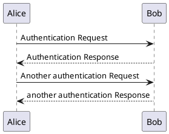
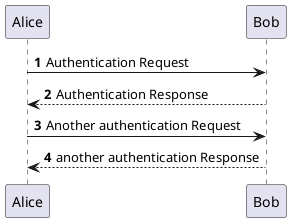
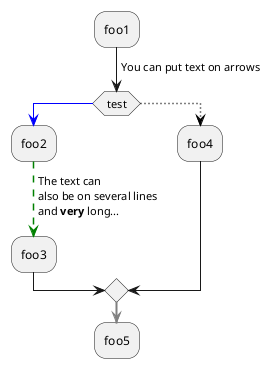

# 程序员是要精还是广?


> [!TIP|style:flat|label:引用头]
> 引用body1
> 
> 摘抄自知乎 @double cheese 的回答
> https://www.zhihu.com/question/467166470/answer/1974787381
> 
> 123132

> [!NOTE|style:flat]
> An alert of type 'note' using global style 'callout'.

> [!NOTE|style:callout]
> An alert of type 'note' using global style 'callout'.


> [!TIP|style:flat]
> An alert of type 'tip' using global style 'callout'.

> [!TIP|style:callout]
> An alert of type 'tip' using global style 'callout'.


> [!WARNING|style:flat]
> An alert of type 'warning' using global style 'callout'.

> [!WARNING|style:callout]
> An alert of type 'warning' using global style 'callout'.


> [!ATTENTION|style:flat]
> An alert of type 'attention' using global style 'callout'.

> [!ATTENTION|style:callout]
> An alert of type 'attention' using global style 'callout'.

https://plantuml.com/zh/


### Section X



# Example

# Basic 1
```plantuml
:一级: -right-*  :二级: 
:二级: -right-*  :三级: 
:三级: -right-*  :一级:

:一级: -right-*  :三级: 
:三级: -right-*  :二级: 
:二级: -right-*  :一级:
```

## Basic 2






<details>
用于折叠信息
</details>


