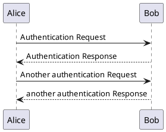
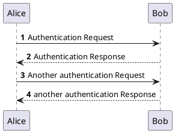
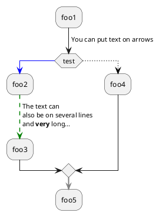

# 如何快速用docsify写一篇文章及各种工具插件

https://plantuml.com/zh/

### Section X

```plantuml
@startuml
Alice -> Bob: Authentication Request
Bob --> Alice: Authentication Response

Alice -> Bob: Another authentication Request
Alice <-- Bob: another authentication Response
@enduml
```

# Example

# Basic 1
```plantuml
:一级: -right-*  :二级: 
:二级: -right-*  :三级: 
:三级: -right-*  :一级:
```

## Basic 2

```plantuml
@startuml
autonumber

Alice -> Bob: Authentication Request
Bob --> Alice: Authentication Response

Alice -> Bob: Another authentication Request
Alice <-- Bob: another authentication Response
@enduml
```

```plantuml

@startuml
:foo1;
-> You can put text on arrows;
if (test) then
  -[#blue]->
  :foo2;
  -[#green,dashed]-> The text can
  also be on several lines
  and **very** long...;
  :foo3;
else
  -[#black,dotted]->
  :foo4;
endif
-[#gray,bold]->
:foo5;
@enduml
```
